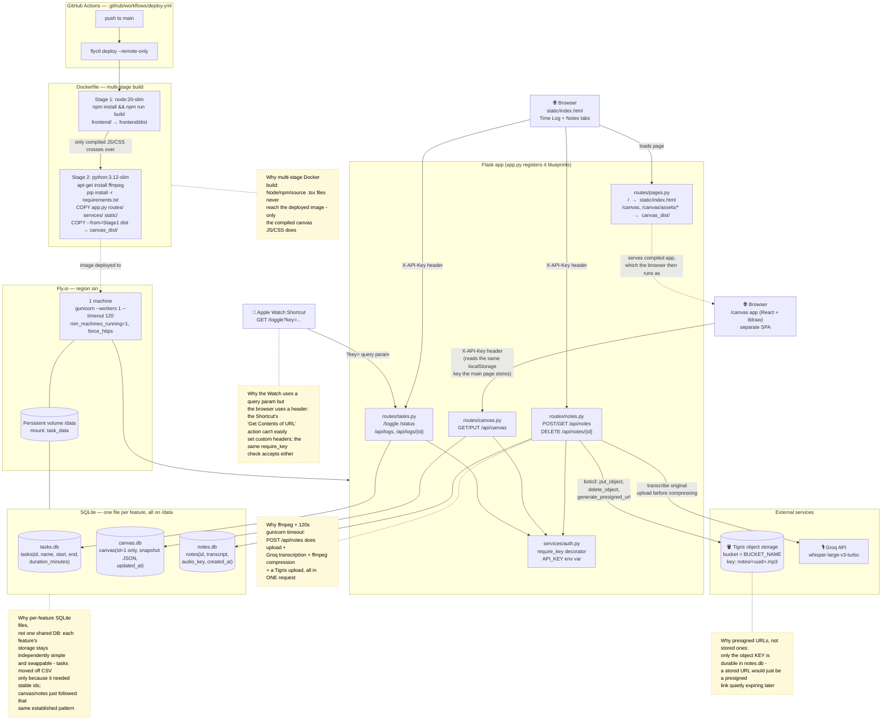

# Current Architecture (as deployed today)

This reflects what's actually in the repo right now: `Dockerfile`, `app.py`,
`routes/`, `services/`, `frontend/`, `fly.toml`, `.github/workflows/`. No
aspirational or planned pieces are included here - see `FUTURE_*` docs (once
they exist) for what's coming.

## Written summary

### Build & deploy
Every push to `main` runs `.github/workflows/deploy.yml`, which just runs
`flyctl deploy --remote-only` - Fly's remote builder does the actual Docker
build, using the `FLY_API_TOKEN` GitHub secret.

**The Dockerfile is two stages** because the canvas feature (`frontend/`) is a
React + Vite + tldraw app that needs Node, npm, and a real build step, but
the *deployed* app is a lightweight Python/Flask process that should never
need Node at runtime. Stage 1 (`node:20-slim`) builds `frontend/` down to
plain JS/CSS/HTML in `frontend/dist`. Stage 2 (`python:3.12-slim`) never sees
Node at all - it only `COPY --from=frontend-build`s the *compiled output*
(as `canvas_dist/`). This keeps the production image small and keeps a
heavy JS toolchain from ever needing to exist on the server.

Stage 2 also `apt-get install`s `ffmpeg` (for voice-note compression -
`python:3.12-slim` doesn't ship it) and installs Python deps plus
`gunicorn`. The `gunicorn` timeout is bumped from the 30s default to 120s
specifically because `POST /api/notes` is a single request that does
upload → Groq transcription → ffmpeg compression → a Tigris upload; a
30s-killed worker there would look like a fast failure instead of a normal,
slightly-slow success.

### Fly.io runtime
One machine in the `sin` region, `min_machines_running = 1` and
`auto_stop_machines = false` (so a request never waits on a cold start), with
one persistent volume mounted at `/data`. `DATA_DIR=/data` is the only reason
the same code works identically in local dev (where `DATA_DIR` defaults to
`.`) and in production - nothing else in the app branches on environment.

### The Flask app
`app.py` itself is just wiring: it creates the app, sets up Swagger docs
(`/docs`, generated from `static/openapi.yaml`), and registers four
blueprints. Every blueprint's actual logic lives in its own `routes/*.py`
file, which calls into `services/*.py` for anything touching a database,
external API, or the filesystem - so a route file is just "parse the
request → call a service → shape the JSON response," nothing else.

- **`routes/pages.py`** - no auth. Serves the webpage (`/`) and the
  *compiled* canvas app (`/canvas`, `/canvas/assets/*`). These are static
  files; nothing sensitive lives here, which is why they're not behind
  `require_key`.
- **`routes/tasks.py`** - the Watch-facing `/toggle` (Start/End a task) and
  `/status`, plus `/api/logs` (list) and `/api/logs/{id}` (get/edit/delete
  one task) for the webpage's bento-card grid and detail view.
- **`routes/canvas.py`** - `GET`/`PUT /api/canvas`, so the tldraw canvas
  persists server-side instead of being stuck in one browser's local storage.
- **`routes/notes.py`** - the voice-notes pipeline described above.

**Every data route is behind `services/auth.py`'s `require_key` decorator**,
a single shared-secret `API_KEY`. It accepts the key from *either* a
`?key=...` query param (what the Watch Shortcut sends - it has no easy way
to set a custom header) *or* an `X-API-Key` header (what the webpage's own
`fetch()` calls send, reading the same key out of `localStorage` that the
canvas app also reads - same origin, so that storage is shared). If
`API_KEY` isn't set at all (e.g. local dev), the check is skipped entirely.

### Storage: one SQLite file per feature
`tasks.db`, `canvas.db`, and `notes.db` each live on the `/data` volume, and
each is owned by exactly one `services/*_db.py` module that's the only code
allowed to touch it. This isn't an accident of three separate features being
built at three separate times so much as a deliberate, repeated choice: tasks
moved off a CSV file specifically because a bento-card grid and per-task
detail page needed a **stable id** that survives edits/deletes (SQLite's
`AUTOINCREMENT` gives that for free); canvas and notes simply followed that
same already-established pattern rather than inventing a fourth approach.
Nothing shares a database, so any one feature's storage could be swapped out
(or migrated to something else entirely) without touching the others.

- **`tasks.db`** - one row per task: `id, name, start, end, duration_minutes`.
  `end`/`duration_minutes` are `NULL` while a task is in progress.
- **`canvas.db`** - exactly one row (`id` is `CHECK`-constrained to `1`),
  holding the tldraw canvas's entire snapshot as a JSON blob plus
  `updated_at`. There's only ever one canvas, so this is deliberately not a
  "table of canvases."
- **`notes.db`** - one row per voice note: `id, transcript, audio_key,
  created_at`. Notice there's no audio data and no URL here - just a
  reference (`audio_key`) to where the real audio lives.

### Voice notes: audio in Tigris, not in SQLite
The actual compressed audio bytes live in **Tigris** (Fly's S3-compatible
object storage), accessed via `boto3` configured with `region_name="auto"`
and `signature_version="s3v4"` (Tigris isn't AWS, so it needs SigV4 signing
explicit - the boto3 default doesn't apply and presigned URLs would come out
broken without it). `notes.db` stores only the object's **key**
(`notes/<uuid>.mp3`), never a URL - `GET /api/notes` calls
`generate_presigned_url` fresh on every request (1-hour expiry) rather than
persisting one, because a stored "permanent" URL would just be a presigned
link quietly going stale later.

The pipeline for `POST /api/notes`, in order: read the uploaded recording →
send the **original, uncompressed** audio to Groq for transcription (best
quality for accuracy) → re-encode it via `ffmpeg` to mono/32kbps → upload
*only* the compressed version to Tigris → save the note row. The original
high-quality upload is never written anywhere permanent; it exists only in
memory for the duration of the request.

### The two clients
- **Apple Watch Shortcut** - a single `GET /toggle?key=...` call. One tap
  toggles Start/End; the server decides which based on whether a task is
  currently open. The Shortcut never sends a name (naming is webpage-only),
  and it's the reason `/toggle` stays a plain `GET` with the key as a query
  param instead of, say, a `POST` with a header or body.
- **The webpage** (`static/index.html`) - a single-file, dependency-free
  HTML/CSS/JS page (no build step, no framework) with three tabs: **Time
  Log** (the bento-card grid + task detail view), **Notes** (record/list/
  play/delete voice notes), and a plain link to **Canvas**, which is a
  *separate* compiled React SPA (`frontend/`) served at `/canvas` - it makes
  its own calls to `/api/canvas`, reading the same stored API key.
