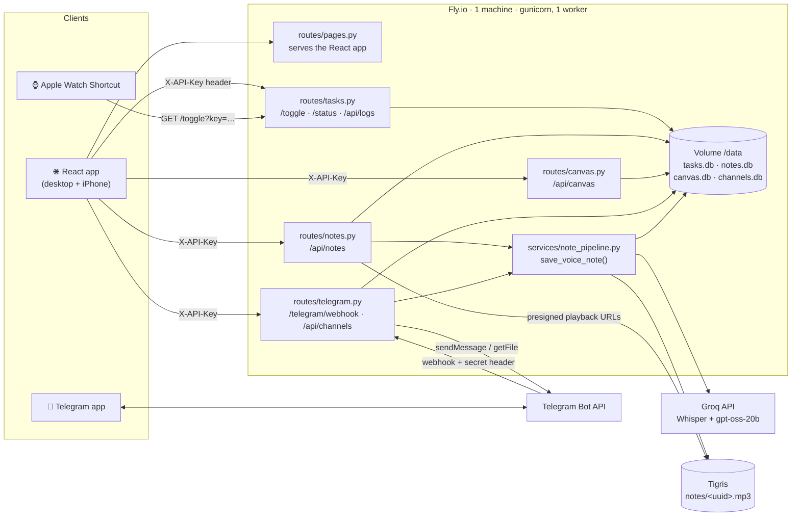
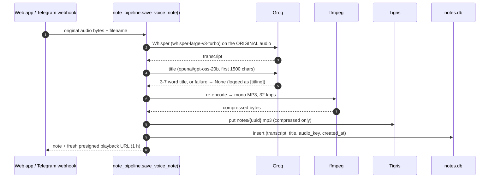
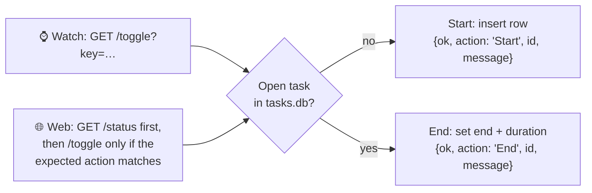
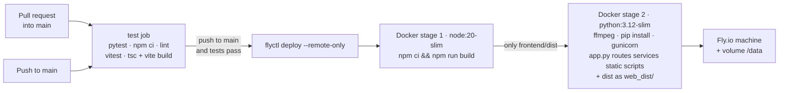

# Architecture

How Sheev is built and deployed **today**. Everything here was checked
against the code on 2026-10-04 (`app.py`, `routes/`, `services/`,
`frontend/`, `Dockerfile`, `fly.toml`, `.github/workflows/deploy.yml`).
Nothing planned or speculative is included; see `TODO.md` for what's next
and `PROJECT_STRUCTURE.md` for what every file does.

**Contents**
1. [Overview](#1-overview)
2. [System diagram](#2-system-diagram)
3. [Key flows](#3-key-flows)
4. [Backend (Flask)](#4-backend-flask)
5. [Storage](#5-storage)
6. [External services](#6-external-services)
7. [Frontend (React)](#7-frontend-react)
8. [Security model](#8-security-model)
9. [Build, CI and deploy](#9-build-ci-and-deploy)
10. [Design decisions](#10-design-decisions)
11. [Known limitations](#11-known-limitations)

---

## 1. Overview

Sheev is a single-user personal tool: one Flask process on one Fly.io
machine, a React app it serves, four small SQLite databases on a
persistent volume, and three external services.

| Part | What it is | Where |
|---|---|---|
| **Clients** | React web app (desktop + phone), Apple Watch Shortcut, Telegram bot | Browser, Watch, Telegram |
| **Server** | Flask app, 5 blueprints, run by gunicorn (1 worker) | Fly.io, region `sin` |
| **Data** | `tasks.db`, `notes.db`, `canvas.db`, `channels.db` (SQLite) | Fly volume at `/data` |
| **Audio** | Compressed voice-note MP3s | Tigris (S3-compatible object storage) |
| **AI** | Whisper transcription + short note titles | Groq API |
| **Messaging** | Bot for sending voice notes in from the phone | Telegram Bot API (webhook) |

The three jobs the app does:
- **Voice notes (main job).** Record in the web app or send a voice note to
  the Telegram bot → transcribed → titled → compressed → stored.
- **Time tracking.** One tap on the Watch (or Start/Stop in the web app)
  starts or ends a task.
- **Canvas.** A tldraw drawing surface, saved on the server.

---

## 2. System diagram

```mermaid
flowchart LR
    subgraph Clients
        Web["🌐 React app<br/>(desktop + iPhone)"]
        Watch["⌚ Apple Watch Shortcut"]
        TGUser["📱 Telegram app"]
    end

    TGAPI["Telegram Bot API"]

    subgraph Fly["Fly.io · 1 machine · gunicorn, 1 worker"]
        direction TB
        Pages["routes/pages.py<br/>serves the React app"]
        Tasks["routes/tasks.py<br/>/toggle · /status · /api/logs"]
        Notes["routes/notes.py<br/>/api/notes"]
        Canvas["routes/canvas.py<br/>/api/canvas"]
        Telegram["routes/telegram.py<br/>/telegram/webhook · /api/channels"]
        Pipeline["services/note_pipeline.py<br/>save_voice_note()"]
        Vol[("Volume /data<br/>tasks.db · notes.db<br/>canvas.db · channels.db")]
    end

    Groq["Groq API<br/>Whisper + gpt-oss-20b"]
    Tigris[("Tigris<br/>notes/&lt;uuid&gt;.mp3")]

    Web -->|"X-API-Key header"| Tasks
    Web --> Pages
    Web -->|"X-API-Key"| Notes
    Web -->|"X-API-Key"| Canvas
    Web -->|"X-API-Key"| Telegram
    Watch -->|"GET /toggle?key=…"| Tasks
    TGUser <--> TGAPI
    TGAPI -->|"webhook + secret header"| Telegram
    Telegram -->|"sendMessage / getFile"| TGAPI

    Notes --> Pipeline
    Telegram --> Pipeline
    Pipeline --> Groq
    Pipeline --> Tigris
    Notes -->|"presigned playback URLs"| Tigris
    Tasks --> Vol
    Notes --> Vol
    Canvas --> Vol
    Telegram --> Vol
    Pipeline --> Vol
```

---

## 3. Key flows

### 3.1 Saving a voice note (web or Telegram)

Both entry points end in the same function, `save_voice_note()`, so a
Telegram note and a web note are stored identically.

```mermaid
sequenceDiagram
    autonumber
    participant C as Web app / Telegram webhook
    participant P as note_pipeline.save_voice_note()
    participant G as Groq
    participant F as ffmpeg
    participant T as Tigris
    participant DB as notes.db

    C->>P: original audio bytes + filename
    P->>G: Whisper (whisper-large-v3-turbo) on the ORIGINAL audio
    G-->>P: transcript
    P->>G: title (openai/gpt-oss-20b, first 1500 chars)
    G-->>P: 3-7 word title, or failure → None (logged as [titling])
    P->>F: re-encode → mono MP3, 32 kbps
    F-->>P: compressed bytes
    P->>T: put notes/{uuid}.mp3 (compressed only)
    P->>DB: insert (transcript, title, audio_key, created_at)
    P-->>C: note + fresh presigned playback URL (1 h)
```

- The original upload is only ever in memory; only the compressed copy is
  stored.
- Transcription, compression, upload or DB failure → the request fails
  with a clear message and nothing is half-saved. A **title** failure
  never fails the save; the UI falls back to the transcript's first words.
- `POST /api/notes` does all of this in one request, which is why
  gunicorn's timeout is 120 s.
- Telegram adds: secret-header check, skip duplicate `update_id`s, only
  linked chats accepted, then the bot replies "Saved ✅" with the title.

### 3.2 Starting / stopping a task

```mermaid
flowchart LR
    W["⌚ Watch: GET /toggle?key=…"] --> T{"Open task<br/>in tasks.db?"}
    B["🌐 Web: GET /status first,<br/>then /toggle only if the<br/>expected action matches"] --> T
    T -- no --> S["Start: insert row<br/>{ok, action: 'Start', id, message}"]
    T -- yes --> E["End: set end + duration<br/>{ok, action: 'End', id, message}"]
```

- The Watch makes one call and the server decides Start or End. It never
  sends a name; tasks are named in the web app.
- The web app **guards** the toggle: it checks `/status` first so a stale
  screen or double tap can't do the opposite of what was meant, and Stop
  never sends a name.
- `/toggle` and `/status` are a **frozen contract** (the Shortcut can't
  be updated with a deploy), pinned by `tests/test_watch_contract.py`.

### 3.3 Connecting Telegram (once)

Web app → `POST /api/channels/telegram/link` → one-time code (10 min,
single use, in `channels.db`) → `t.me/<bot>?start=<code>` link → user
taps Start in Telegram → webhook receives `/start <code>` → chat linked
to user 1 → bot replies "Connected ✅". Full flowcharts:
`docs/features/messaging-channel.md`.

---

## 4. Backend (Flask)

`app.py` only wires things up: it creates the app, mounts Swagger UI at
`/docs` (from `static/openapi.yaml`), registers the blueprints, and
returns a JSON 404 for anything unknown. Route files parse the request,
call `services/`, and shape the JSON; all storage and external calls live
in `services/`.

| Blueprint | Endpoints | Auth |
|---|---|---|
| `routes/tasks.py` | `GET /toggle[?name=]`, `GET /status`, `GET /api/logs`, `GET`/`PATCH`/`DELETE /api/logs/<id>` | API key |
| `routes/notes.py` | `GET`/`POST /api/notes`, `PATCH`/`DELETE /api/notes/<id>` | API key |
| `routes/canvas.py` | `GET`/`PUT /api/canvas` | API key |
| `routes/telegram.py` | `POST /telegram/webhook` | Telegram secret header |
| | `POST /api/channels/telegram/link`, `POST /api/channels/test` | API key |
| `routes/pages.py` | `/`, `/tasks`, `/tasks/<id>`, `/time-log`, `/notes`, `/notes/<id>`, `/canvas`, `/integrations/<name>`, `/settings`, `/more` → React `index.html`; `/app/assets/*` → built files; `/app/*` → 301 to the same path without `/app` | none (static files) |
| Swagger UI | `/docs`, `/static/openapi.yaml` | none |

**Services**

| Module | Responsibility |
|---|---|
| `auth.py` | `require_key` decorator |
| `tasks_db.py`, `notes_db.py`, `canvas_db.py`, `channels_db.py` | The only code that touches each SQLite file |
| `note_pipeline.py` | `save_voice_note()` - the shared pipeline in §3.1 |
| `transcription.py` | Groq Whisper |
| `titling.py` | Groq title; never raises |
| `audio_compression.py` | ffmpeg re-encode |
| `object_storage.py` | Tigris upload/delete/presigned URLs |
| `channels.py` | `send_to_user()` (bot test message) |
| `telegram.py` | Bot API wrapper: `send_message`, `download_voice` |
| `time.py`, `config.py` | `local_now()` in `TIMEZONE`; `DATA_DIR` |

---

## 5. Storage

### SQLite - one file per feature, all on the `/data` volume

| File | Table(s) | Notes |
|---|---|---|
| `tasks.db` | `tasks(id, name, start, end, duration_minutes)` | `end`/`duration_minutes` are NULL while running. `AUTOINCREMENT` ids are never reused. |
| `notes.db` | `notes(id, transcript, title, audio_key, created_at)` | `title` is nullable, added in place to older databases. No audio or URLs - just the Tigris key. |
| `canvas.db` | `canvas(id = 1, snapshot, updated_at)` | Exactly one row; the whole tldraw snapshot as JSON. |
| `channels.db` | `links`, `link_codes`, `seen_updates` | Telegram link (user 1 ↔ chat id), one-time codes, processed webhook ids. |

Each database is owned by exactly one `services/*_db.py` module, opened
per request. `DATA_DIR` is `/data` on Fly and `.` locally - the only
thing that differs between environments.

### Tigris - audio only

Key `notes/<uuid>.mp3`. boto3 with `region_name="auto"` and
`signature_version="s3v4"` (needed for Tigris presigned URLs). Playback
URLs are minted fresh on every `GET /api/notes`, valid for 1 hour.

### Timestamps

Stored as `YYYY-MM-DD HH:MM:SS` wall-clock time in `TIMEZONE`
(`Asia/Kolkata`), with no offset. The frontend parses them by hand
(`src/utils/time.ts`) and must use the same zone (`SERVER_TIMEZONE`).

---

## 6. External services

| Service | Used for | Details |
|---|---|---|
| **Groq** | Transcription | `whisper-large-v3-turbo`, on the original audio |
| **Groq** | Note titles | `openai/gpt-oss-20b`, `reasoning_effort="low"`, `temperature=0`, first 1500 chars; free tier |
| **Tigris** | Audio storage | Fly's S3-compatible object storage |
| **Telegram Bot API** | Voice notes in from the phone | Webhook (not polling) - the machine is always on |

---

## 7. Frontend (React)

One React 19 + TypeScript app (`frontend/`), built with Vite and styled
with Tailwind CSS v4, served by Flask at `/`. It replaced an older
single-file page and a separate canvas app.

- **Screens:** Home (notes-first: Record card, recent notes by day,
  running-task strip), Notes, Tasks, Time Log, Canvas, Apple Watch,
  Telegram, Settings. Sidebar on desktop, bottom nav + Capture button on
  phones.
- **Data:** all network calls live in `src/api/`; React Query caches
  server data (`['tasks']`, `['notes']`, `['status']`). Home, Tasks and
  Time Log share one task list, so they can't disagree.
- **Recorder:** a state machine (`recorderController.ts`) in an app-wide
  provider, so a recording keeps going across navigation and a failed
  upload can be retried with the same audio.
- **Canvas:** tldraw is lazy-loaded only on `/canvas`.
- **Measured 2026-10-04 (production):** initial JS 177 KB gzipped;
  Lighthouse mobile on Home: Performance 97, Accessibility 100.

Design system, folder rules and the full screen spec:
`docs/features/frontend-redesign.md`.

---

## 8. Security model

- **One shared API key** (`API_KEY`, a Fly secret). Every data route
  checks it via `require_key`, from either `?key=` (the Watch Shortcut
  can't easily set headers) or the `X-API-Key` header (the web app). If
  `API_KEY` is unset - local development only - the check is skipped.
- **Web sign-in:** the key is kept in `localStorage`
  (`task_logger_api_key`) with a 24-hour sliding expiry; any 401 signs
  the user out.
- **Telegram webhook:** not key-protected; verified by Telegram's
  `X-Telegram-Bot-Api-Secret-Token` header instead. Duplicate updates are
  ignored and unlinked chats get one "not linked" reply.
- **Audio:** the Tigris bucket isn't public; playback uses presigned URLs
  that expire after 1 hour.
- **Page routes are public** - they only serve the static app; all data
  behind them needs the key.
- **Secrets** live only in Fly (`fly secrets set`), never in git:
  `API_KEY`, `GROQ_API_KEY`, `AWS_ACCESS_KEY_ID`, `AWS_SECRET_ACCESS_KEY`,
  `AWS_ENDPOINT_URL_S3`, `BUCKET_NAME`, `TELEGRAM_BOT_TOKEN`,
  `TELEGRAM_BOT_USERNAME`, `TELEGRAM_WEBHOOK_SECRET`.

---

## 9. Build, CI and deploy

```mermaid
flowchart LR
    PR["Pull request<br/>into main"] --> Test
    Push["Push to main"] --> Test
    Test["test job<br/>pytest · npm ci · lint<br/>vitest · tsc + vite build"]
    Test -->|"push to main<br/>and tests pass"| Deploy["flyctl deploy --remote-only"]
    Deploy --> S1["Docker stage 1 · node:20-slim<br/>npm ci && npm run build"]
    S1 -->|"only frontend/dist"| S2["Docker stage 2 · python:3.12-slim<br/>ffmpeg · pip install · gunicorn<br/>app.py routes services static scripts<br/>+ dist as web_dist/"]
    S2 --> Fly["Fly.io machine<br/>+ volume /data"]
```

- **CI** (`.github/workflows/deploy.yml`): every PR and push runs the
  tests; only a push to `main` deploys, and only if the tests pass.
- **Two-stage Docker build:** Node and the frontend sources never reach
  the production image - only the compiled JS/CSS does.
- **Fly runtime** (`fly.toml`): one machine in `sin`,
  `min_machines_running = 1`, `auto_stop_machines = false` (no cold
  starts; the Telegram webhook can always reach it), `force_https`,
  volume `task_data` at `/data`, `TIMEZONE=Asia/Kolkata`.
- **gunicorn:** 1 worker, `--timeout 120`.
- **Maintenance scripts** (`scripts/`) ship in the image and run with
  `fly ssh console -C "python scripts/<name>.py"`.

---

## 10. Design decisions

| Decision | Why |
|---|---|
| One SQLite file per feature | Each feature's storage stays simple and swappable; tasks moved off CSV only to get stable ids, and later features followed the same pattern. |
| Audio in Tigris, only the key in SQLite | Keeps the databases tiny; presigned URLs expire, so storing them would just store links that go stale. |
| Transcribe the original, store the compressed copy | Best transcription accuracy, smallest storage. |
| Title never blocks a save | Titles are nice-to-have; a Groq hiccup shouldn't lose a note. Failures are logged, not silent. |
| Inline pipeline, no job queue | Whisper + a small title call + ffmpeg fit in one request; simpler than a queue for one user. |
| `GET /toggle` with `?key=` | What the Watch Shortcut can do in one tap; the contract is frozen. |
| Guarded toggle in the web app | `/toggle` flips state blindly; checking `/status` first prevents wrong-way presses. |
| Fixed page-route list, no catch-all | Unknown URLs (incl. `/api/*`) keep returning JSON 404s, which the Watch relies on. |
| Telegram via webhook, Python in the same app | One deploy; reuses the notes pipeline directly. |
| Two-stage Docker build | No Node toolchain in the production image. |
| Single user, shared key | It's a personal tool; accounts add complexity with no benefit. |

---

## 11. Known limitations

- **One gunicorn worker:** while a voice note is being processed (up to
  2 minutes), other requests - including a Watch tap - wait.
- **One canvas, last write wins.** No versioning or merge.
- **A 401 during a voice-note upload signs you out and loses the
  recording** - tracked in `TODO.md` §3.
- **Groq free tier** limits apply (e.g. 30 title requests/min).
- **Single user by design** - every Telegram link and all data belong to
  one person.
