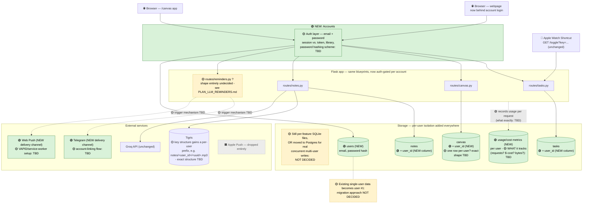

# Future Architecture: After the Multi-User Pivot

**This is speculative, not a build plan.** It shows what the current
architecture (`ARCHITECTURE.md`) becomes if every decision already made
in `PLAN_MULTI_USER.md` is applied - color-coded so it's obvious what's
actually decided (🟢 green), what's a firm decision but with real gaps in
*how* (🟡 yellow, dashed), and what's being removed (⬛ grey). Nothing
yellow was guessed at; each one is a listed open question in
`PLAN_MULTI_USER.md` or `PLAN_LLM_REMINDERS.md`. This pivot is explicitly
**deferred until after everything else** - this diagram exists so the
gaps are visible now, not because it's happening next.

## What actually changes from today

**Decided (🟢):**
- A new `users` table/store and an auth layer gate every route that's
  currently protected by the single shared `API_KEY`.
- `tasks`, `canvas`, and `notes` all gain per-user isolation - shown
  here as a `user_id` column, the natural shape of "per-user isolation
  across every database," though the exact column name/shape is itself
  one of the yellow items below.
- A new usage/cost-metrics store, per user.
- Telegram and Web Push become real delivery channels; Apple Push is
  removed from the picture entirely, not just deprioritized.

**Genuinely undecided (🟡) - not guessed at here:**
- Whether SQLite-per-feature survives real concurrent multi-user
  writes, or this is also when the database engine changes (e.g. to
  Postgres). This is the single biggest fork in what this diagram
  could actually look like, and it's unresolved.
- The auth mechanism itself (sessions vs. tokens, which library,
  password hashing).
- Whether `canvas` becomes "one row per user" or something else - today
  it's hard-constrained to exactly one row, period.
- What the usage/cost metrics actually measure.
- The exact Tigris key structure once it's per-user.
- How today's single-user data becomes the first real account.
- What triggers a reminder at all, and therefore what
  `routes/reminders.py` (if that's even its name) looks like - this
  entire box is a placeholder for a feature with no spec yet
  (`PLAN_LLM_REMINDERS.md`).
- Telegram account-linking and Web Push's browser-permission/VAPID setup.

**Removed (⬛):**
- Apple Push, entirely - not replaced with anything Apple-specific, per
  the decision already made.
