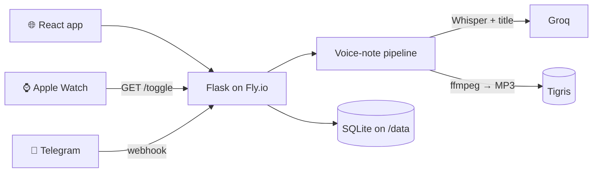

# Sheev

<video src="https://streamable.com/ilfs39" width="100%" controls preload="metadata">
</video>

**A personal voice-notes and time-tracking tool - record a thought from
your phone, Apple Watch or Telegram and get back a searchable, AI-titled
note.**

Sheev is a tool I built for my own daily use and keep growing one
experiment at a time (experiment → learn → add → remove → repeat). Its
main job is capturing voice notes: speak, and a few seconds later the
note is transcribed by Whisper, given a short title by an LLM, compressed
and stored. Its second job is one-tap time tracking from an Apple Watch.

Live at [applewatchtriggers.fly.dev](https://applewatchtriggers.fly.dev)
(private - it needs an API key).

---

## Features

- 🎙️ **Voice notes** - record in the browser (desktop or iPhone); the
  server transcribes with **Groq Whisper** (`whisper-large-v3-turbo`),
  writes a 3-7 word title with **`openai/gpt-oss-20b`**, re-encodes the
  audio to a small mono MP3 with **ffmpeg**, and stores it in **Tigris**
  object storage. Titles are editable; search covers titles and
  transcripts.
- 💬 **Telegram channel** - send a voice note to the bot from your
  phone and it goes through exactly the same pipeline; the bot replies
  "Saved ✅" with the title. Connect once via a one-time deep link.
- ⌚ **Apple Watch time tracking** - a Shortcut calls `GET /toggle`; one
  tap starts a task, the next ends it. Tasks can be named, edited,
  reopened and reviewed by day in the web app.
- 🎨 **Canvas** - a tldraw whiteboard saved on the server, so it's the
  same on every device.
- 📱 **One responsive React app** - notes-first Home, Notes, Tasks, Time
  Log, Canvas, Watch and Telegram setup screens, light/dark themes and
  keyboard shortcuts. Lighthouse mobile: **Performance 97,
  Accessibility 100**.

## Tech stack

| Layer | Tools |
|---|---|
| Frontend | React 19, TypeScript, Vite, Tailwind CSS v4, React Router 7, TanStack Query, Radix UI, tldraw, Vitest |
| Backend | Python 3.12, Flask, gunicorn, SQLite, Swagger UI (OpenAPI 3) |
| AI | Groq API - Whisper (speech-to-text), `openai/gpt-oss-20b` (titles) |
| Storage | SQLite on a Fly volume (one file per feature), Tigris (S3-compatible) for audio via boto3 |
| Media | ffmpeg |
| Integrations | Telegram Bot API (webhook), Apple Shortcuts |
| Infra | Docker (multi-stage), Fly.io, GitHub Actions (test → deploy) |

## How it works



A voice note, whether it comes from the browser or Telegram, goes through
one function: transcribe the original audio → generate a title (optional,
never blocks the save) → compress → upload to Tigris → save the
transcript, title and object key in SQLite. Full details, diagrams and
design decisions: **[ARCHITECTURE.md](ARCHITECTURE.md)**.

## Running it locally

You need Python 3.12+, Node 20+ and `ffmpeg` on your PATH.

```bash
# Backend
python3 -m venv .venv
.venv/bin/pip install -r requirements-dev.txt   # includes requirements.txt + pytest
.venv/bin/python -m flask --app app run --port 8080 --debug

# Frontend (second terminal) - live reload on http://localhost:5173,
# proxying API calls to Flask on :8080
cd frontend
npm install
npm run dev
```

With `API_KEY` unset, the API skips the key check (local development
only) - type anything on the sign-in screen. Recording voice notes needs
the Groq and Tigris variables below; everything else works without them.

To serve the built app from Flask instead of Vite:

```bash
cd frontend && npm run build && cp -R dist ../web_dist
```

### Environment variables

| Variable | Needed for |
|---|---|
| `API_KEY` | Protects every data route (`?key=` or `X-API-Key`) |
| `GROQ_API_KEY` | Transcription and titles |
| `AWS_ACCESS_KEY_ID`, `AWS_SECRET_ACCESS_KEY`, `AWS_ENDPOINT_URL_S3`, `BUCKET_NAME` | Tigris audio storage |
| `TELEGRAM_BOT_TOKEN`, `TELEGRAM_BOT_USERNAME`, `TELEGRAM_WEBHOOK_SECRET` | Telegram bot |
| `DATA_DIR` | Where the SQLite files go (`/data` on Fly, `.` by default) |
| `TIMEZONE` | Timestamp time zone (`Asia/Kolkata`) |

## Tests

```bash
.venv/bin/python -m pytest                              # backend: Watch contract, routing, note titles
cd frontend && npm test && npm run lint && npm run build # frontend: unit tests, lint, type-check + build
```

GitHub Actions runs all of these on every pull request and push to
`main`, and only deploys if they pass.

## Deployment

Pushing to `main` deploys automatically: GitHub Actions runs the tests,
then `flyctl deploy --remote-only`. The Dockerfile builds the React app
in a Node stage and copies only the compiled files into a slim Python
image with ffmpeg and gunicorn. Data lives on a Fly volume mounted at
`/data`; secrets are set with `fly secrets set`.

## API

Interactive docs are served at `/docs` (Swagger UI) from
[`static/openapi.yaml`](static/openapi.yaml).

## Project docs

| Doc | What's in it |
|---|---|
| [ARCHITECTURE.md](ARCHITECTURE.md) | How the system is built, with diagrams |
| [PROJECT_STRUCTURE.md](PROJECT_STRUCTURE.md) | What every file and folder is for |
| [TODO.md](TODO.md) | Roadmap and backlog |
| [docs/PROCESS.md](docs/PROCESS.md) | How features are planned: Think → Draw → 🔒 Lock → Build |
| [docs/features/](docs/features/) | One design doc per feature |
| [docs/claude-handoff.md](docs/claude-handoff.md) | Start-here guide for AI coding agents |

## License

[MIT](LICENSE) © 2026 Vivek Jagdish Patel
