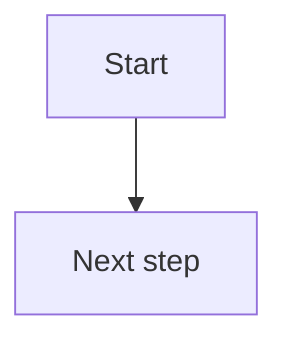
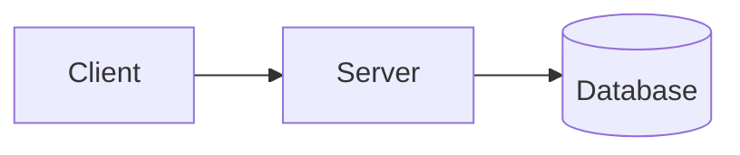

# <Feature name>

**Status:** 1. Think  <!-- 1. Think → 2. Draw → 🔒 Locked → 3. Build → ✅ Shipped -->

---

## 1. Think

**Problem:** What's missing or annoying today?

**Building:**
- 

**Not building:**
- 

**Options I looked at:**
| Option | Good | Bad |
|--------|------|-----|
|  |  |  |

**Open questions:**
- [ ] 

---

## 2. Draw

### Flowchart — what happens, step by step

### Architecture — the parts and who talks to whom

### Decisions
<!-- One line each: what I chose, and why. Add new lines if things change later. -->
- 

---

## 3. Build

- [ ] 

**What actually got built / what I learned:**
