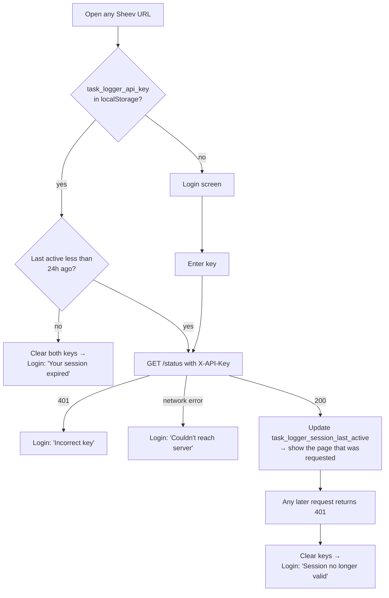
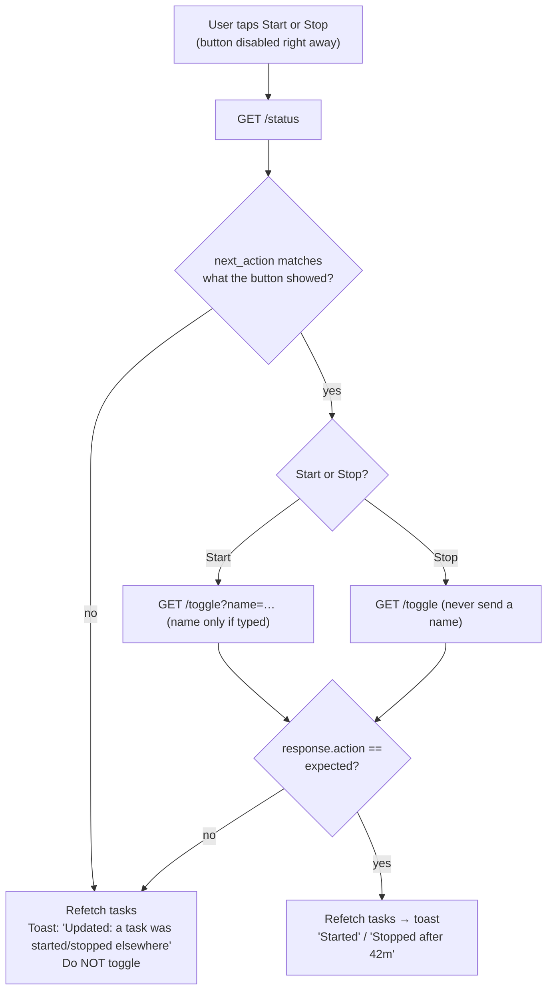
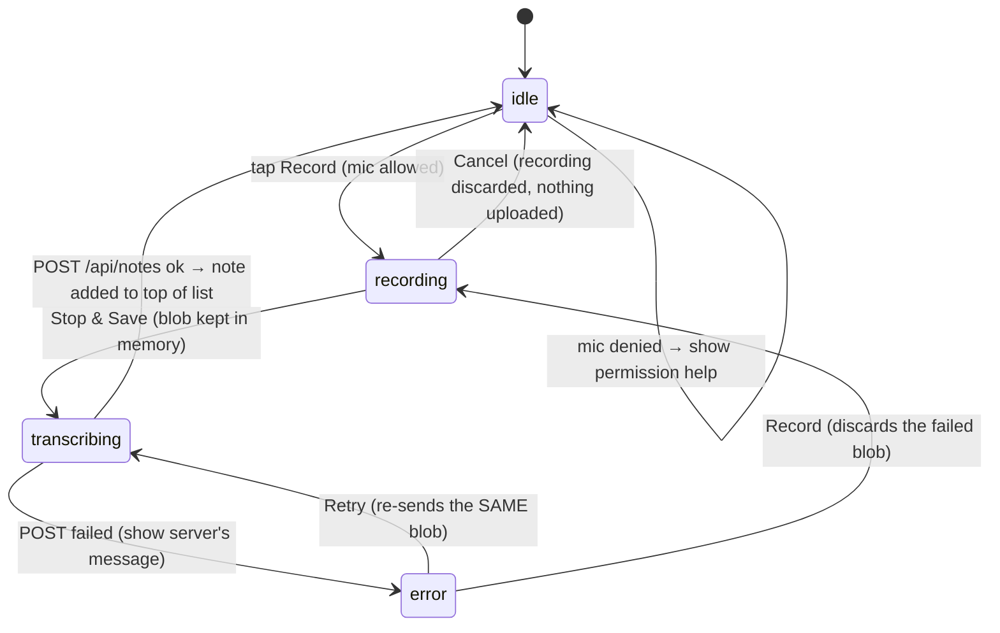
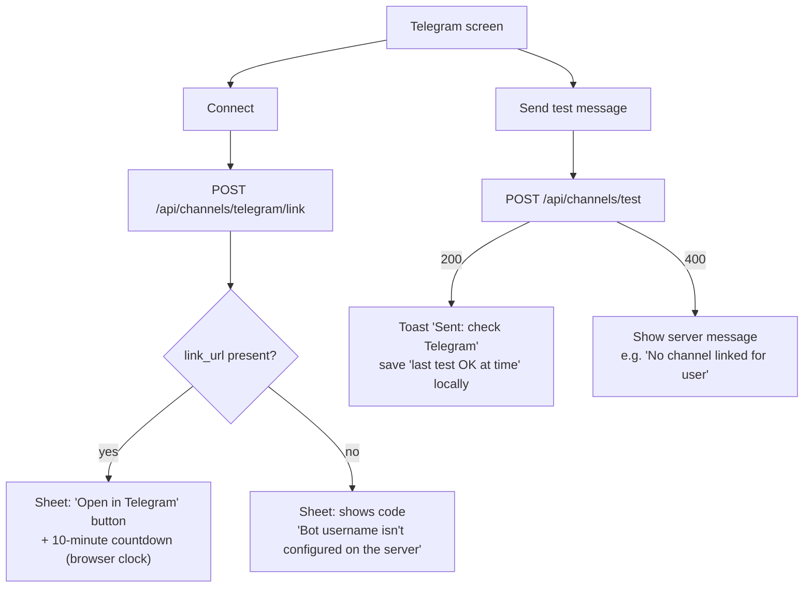
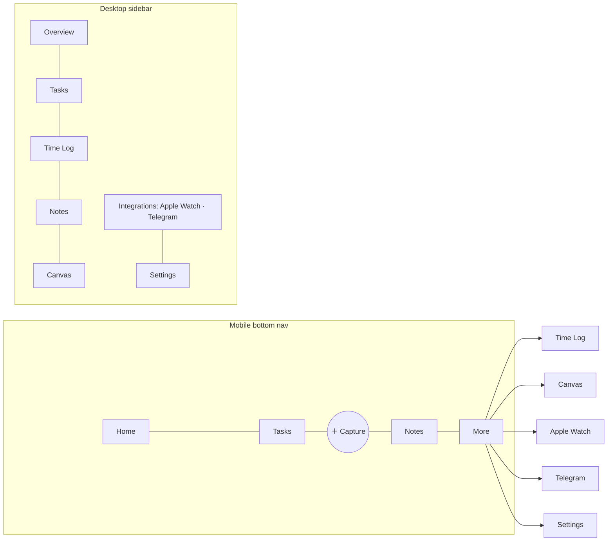
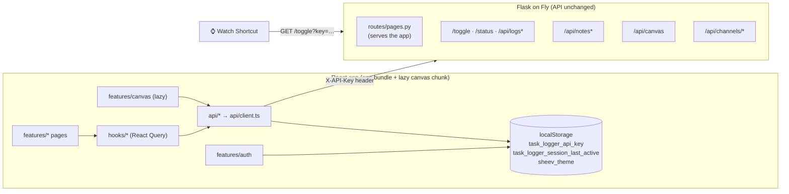
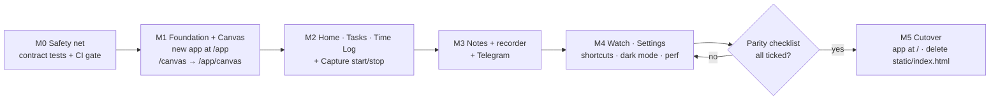

# Frontend redesign

**Status:** 3. Build - built, merged and live at `/`; formal sign-off still open  <!-- 1. Think → 2. Draw → 🔒 Locked → 3. Build → ✅ Shipped -->

*Started 2026-09-30. Based on the Phase 0 repository audit (same date).*

> **Build progress (updated 2026-10-04)**
>
> | Phase / milestone | State |
> |---|---|
> | M0 - pytest contract/routing tests + CI gate | ✅ Done (PR #1) |
> | Phases 2-5 (M1-M3) - shell, design system, Home, Tasks, Time Log, Notes + recorder | ✅ Done (PR #1) |
> | Phase 6 - Apple Watch, Telegram, Settings, keyboard shortcuts | ✅ Built and merged (PR #2); no formal review recorded |
> | Phase 6.5 - Home + Tasks phone layouts (no sideways scroll at 320-430px) | ✅ Built and merged (PR #3); no formal review recorded |
> | M5 cutover - React app at `/`, `/app/*` 301-redirects | ✅ Done (PR #4), except deleting `static/index.html` |
> | Phase 7 - canvas review in the finished shell | Not started |
> | Perf/a11y checks + §13 parity walk-through | Not started - none of §13 has been formally walked yet |
> | Phases 8-10 - real-time UX, polish, demo | Not started; demo is covered by the Loom video in `TODO.md` §1 |
>
> To mark this ✅ Shipped: walk §13 on a phone and a desktop, do the
> Phase 7 canvas review and the perf/a11y checks, then delete
> `static/index.html`. Tracked in `TODO.md` §2; known bugs in `TODO.md` §3.
>
> **Superseded by a later feature** (`docs/features/notes-first-ai-titles.md`,
> shipped 2026-10-04) - where this spec and that file disagree, that file wins:
> - **Home is notes-first**, not task-first: a big Record card, recent notes
>   grouped by day, and a slim running-task strip. The Active session card
>   and Today stats in §5.3 were removed from Home (today's totals are on
>   Time Log). The nav label is "Home" everywhere (no "Overview").
> - **Nav order:** sidebar Home, Notes, Tasks, Time Log, Canvas; phone bottom
>   nav Home · Notes · ➕ Capture · Tasks · More (§5.1 shows the old order).
> - **Notes have titles** (AI-generated, editable via `PATCH /api/notes/<id>`),
>   so the §3 non-goal "editing note titles", the §4.6 "first line of the
>   transcript is used as its title" and the §9 "no new endpoints" no longer
>   describe the app. Search covers titles and transcripts.

This doc covers **Think** and **Draw** for the redesign. The **Build** task
list is in §10 (Migration strategy), and the finish line is in §13
(Definition of Done).

---

## 1. Problem

Sheev works, but its frontend doesn't match what it has become.

- **Two frontends that don't know about each other.** Time Log and Notes are
  one 975-line hand-written file (`static/index.html`). The canvas is a
  separate React/Vite app (`frontend/`). They share only a localStorage key.
  Nothing is shared: no components, no styles, no API client, no navigation.
- **No URLs for things.** Views are switched by toggling CSS classes, so
  you can't link to a task or note, and the browser Back button doesn't work
  inside the app.
- **Built as a single mobile column.** On desktop it's the same narrow
  column stretched out, with no sidebar, no dense views, and no keyboard
  shortcuts.
- **Looks like a prototype.** `alert()`/`confirm()` pop-ups, emoji as icons,
  dark-only styling, inline styles repeated by hand, and no design system.
- **Things fail silently.** The canvas never checks whether a save
  succeeded. A double-tap on Start/End can do the opposite of what you
  meant, because `/toggle` flips whatever the current state is.
- **Features aren't visible.** The Apple Watch integration, the heart of the
  project, has no screen at all. Telegram is a small bar tucked inside
  Notes.

## 2. Product goal

**Sheev is a personal command center for capturing, tracking and organizing
work across Apple Watch, mobile and desktop.**

Core principle: **Capture → Track → Organize.**

| | Capture | Track | Organize |
|---|---|---|---|
| Watch | Tap to start/stop | — | — |
| Telegram | Send a voice note | — | — |
| Web app | Capture sheet: start task, record note | Home live session, Time Log | Tasks, Notes, Canvas |

The redesigned frontend should:
- feel like professional SaaS software, with the density and information
  structure of Linear/Jira but its own visual identity;
- be **mobile-first**: desktop expands the mobile layout rather than mobile
  shrinking a desktop layout;
- make **Home** the demo/portfolio "wow" screen;
- run on **today's backend API with no API changes** (see §9);
- replace both old frontends **gradually**, never leaving you without a
  working app.

## 3. Non-goals

Not in this feature:

- **Any change to the backend API.** No new endpoints, fields or database
  tables. The only server-side changes are page serving (§8.6) and new
  tests (§10, M0).
- **Kanban board**, projects, tags, priorities, due dates, or linking notes
  to tasks. The backend has none of these. Kanban is a possible later
  enhancement.
- **A to-do list separate from time tracking.** In the backend a "task" *is*
  a timed session (see §4.2).
- **Telegram link status or unlink.** The backend can't report either.
- **Detecting whether the Watch Shortcut is installed, or which device
  pressed toggle.** The backend doesn't record the source.
- **Editing transcripts**, note titles, or note search on the server
  (in-browser search over loaded notes *is* in scope).
- **Offline mode / PWA / push notifications.**
- **Multi-user accounts.** Still the single shared API key
  (`docs/plans/PLAN_MULTI_USER.md` remains deferred).
- **Upgrading tldraw** or changing how the canvas is stored.
- **Charts or analytics** beyond the Home stats listed in §5.2.

---

## 4. User flows

### 4.1 Sign in and session (behaviour unchanged, new UI)



- The login screen is a **gate**, not a route: after signing in you land on
  the URL you originally opened.
- Returning to a tab after it's been hidden re-checks expiry, as today.

### 4.2 What "Task" means (one data model, two views)

The backend has one entity: a row in `tasks.db` with
`{id, name, start, end|null, duration_minutes|null}`. Each row is **one
timed piece of work**. There is no separate to-do concept.

- **Tasks** = the *what* view. Every task by name, with Active/Completed
  filter, search and detail.
- **Time Log** = the *when* view. The same rows, in time order, grouped by
  day with daily totals.
- Both open the same task detail (`/tasks/:id`).
- **Active** = `end` is null (at most one at a time). **Completed** = `end`
  is set.

### 4.3 Start / stop a task (the guarded toggle)

`/toggle` flips whatever the current state is. The Watch depends on that
and it stays unchanged. The new app wraps it in a check so a stale screen or
a double-tap can never do the opposite of what the user meant.



- **Start** opens a small sheet: "What are you working on?", an optional
  name field (autofocused), chips with the 5 most recent distinct names, and
  a Start button. Leaving the name blank is fine: the backend gives it
  "Task – Fri, 9:00 AM".
- **Stop** happens right away, with no confirmation. It **never sends
  `name`**, because `/toggle` on End overwrites the name when one is
  passed. Renaming is done in task detail (PATCH).
- **Start again** (on a completed task, only when nothing is active) starts
  a *new* task with the same name via `/toggle?name=`. The backend can't
  reopen the old row.

### 4.4 Edit / delete a task

1. Open `/tasks/:id` (full screen on mobile, drawer on desktop).
2. Edit name, start, end. Validated in the browser before sending:
   - timestamps in `YYYY-MM-DD HH:MM:SS` format;
   - **end must be later than start** (the backend doesn't check this);
   - **clearing end** (reopening the task) is allowed only when no other
     task is active. Otherwise it's disabled, with the explanation "Stop
     the active task first" (two open tasks would confuse `/toggle`).
3. Save sends `PATCH /api/logs/:id` with **only the changed fields**
   (existing behaviour).
4. Delete: confirm (bottom sheet on mobile, dialog on desktop), then
   `DELETE /api/logs/:id`, then go back to the list. Deleting the *active*
   task shows the extra line "This task is still running."

### 4.5 Record a voice note (existing state machine, kept exactly)



Preserved details:
- The file extension comes from the MIME type (`mp4` if the type contains
  "mp4", otherwise `webm`). Safari records mp4.
- The multipart upload **never sets `Content-Type` by hand**.
- The mic stream's tracks are stopped in `onstop`.
- A "cancelled" flag is set before `stop()` so Cancel doesn't upload.
- Recording is only allowed from `idle`/`error`. The Record button is
  disabled while `transcribing`.

New, browser-only additions:
- An elapsed-time counter while recording.
- The recorder lives in an **app-level provider**, so a recording or upload
  keeps going if you navigate away. While it's active and you're not on
  Notes, a small status pill ("● Recording 0:12 ■" / "Transcribing…")
  appears above the mobile bottom nav or in the desktop top bar.
- Recording can start from the **Capture** sheet. The tap on "Record" is the
  user gesture the mic permission needs.

### 4.6 Browse, play, delete notes

- The list shows a transcript preview (3 lines), created time, and a compact
  play/pause button.
- Detail (`/notes/:id`): full transcript, native audio controls, a "Copy
  transcript" button (browser only), and delete (with confirm).
- In-browser search over transcripts that are already loaded.
- **Expired audio links** (they last 1 hour): the notes list is refetched
  when the tab regains focus if it's more than 50 minutes old. If an
  `<audio>` element fails to load, the app refetches once and retries.
- A note has no title field, so the first line of the transcript is used as
  its title.

### 4.7 Capture

"Capture" is the center button in the mobile bottom nav, `C` on desktop, or
the primary button on Home. It opens a sheet with:
1. **Start task** (§4.3), or **Stop "<name>"** if a task is active;
2. **Record voice note** (§4.5);
3. **Open canvas**.

### 4.8 Telegram (existing capability only)



Status is shown honestly: *"Sheev can't check link status yet. Send a test
message to confirm."* plus "Last successful test: <time>" if there is one.

### 4.9 Apple Watch

The screen shows what can actually be known, and explains the setup:
- **API status**: `GET /status` reachable (OK / error). Also shows **"Next
  press will: Start / Stop"** and the active task, if any.
- **How it works**: diagram of Shortcut → `GET /toggle?key=…` → Sheev →
  `tasks.db`, plus what `/status` does.
- **Setup**: the Shortcut URL, built from `window.location.origin`, with the
  key hidden (`/toggle?key=••••••`). Reveal and Copy buttons, each needing a
  tap.
- **Recent start/stop activity**: last 10 start/stop events, labelled
  *"Includes the Watch and the web app. Sheev doesn't record which device
  was used."*
- **Troubleshooting**: 401 means the Shortcut's key doesn't match; the
  expected JSON response shape; what "Unknown endpoint" means.

---

## 5. Information architecture

### 5.1 Map



"Home" (mobile) and "Overview" (desktop) are **the same route and screen**.
Only the nav label differs.

### 5.2 Routes

| Route | Screen | Mobile presentation | Desktop presentation |
|---|---|---|---|
| `/` | Home / Overview | Stacked cards | Two-column grid |
| `/tasks` | Tasks | Card list | Table |
| `/tasks/:id` | Task detail | Full screen | Right-side drawer over the table |
| `/time-log` | Time Log | Timeline grouped by day | Dense table with day headers |
| `/notes` | Notes | Card list | Two panes (list + detail) |
| `/notes/:id` | Note detail | Full screen | Selected in the right pane |
| `/canvas` | Canvas (lazy-loaded) | Full screen, nav hidden, back button | Full-bleed, sidebar collapsed to icons |
| `/integrations/watch` | Apple Watch | Stacked sections | Two columns |
| `/integrations/telegram` | Telegram | Stacked sections | Two columns |
| `/settings` | Settings | Grouped list | Grouped list, max width 720px |
| `/more` | More menu | List of links | Redirects to `/` (sidebar has everything) |

Login and Capture are **not routes**: login is a gate, Capture is a sheet.

### 5.3 Contents per screen

**Home / Overview**
- Greeting ("Good morning/afternoon/evening", using server-timezone hour) and
  today's date.
- **Active session card**: name, `#id`, start time, **live duration**
  (ticks every second, computed in the browser), Stop. With no active task:
  "Nothing running" and Start.
- **Today stats**: *Focus time* (sum of today's completed durations plus the
  live elapsed time of an active task started today), *Tasks* (started
  today), *Notes* (created today). "Today" is the date in the server
  timezone; a task counts on the date it **started** (same as the
  backend's `date` field).
- **Recent activity**: last 8 events merged from tasks and notes ("Started
  X", "Stopped X · 42m", "Voice note saved"). No device/source labels.
- **Primary Capture button**.

**Tasks**
- Search by name, filter (All · Active · Completed), 50 items at a time with
  a "Show more" button. This is **client-side progressive display, not
  backend pagination**: the full list still comes from one unchanged
  `GET /api/logs` call, and the browser just reveals it 50 rows at a time.
- Mobile card: name, `#id`, date · time range, duration or "Active" badge.
- Desktop table columns: ID · Name · Date · Start · End · Duration · Status.

**Time Log**
- Range filter: Today · 7 days · 30 days · All.
- Groups by date (newest first), each with a **daily total**.
- Each entry shows: name, `#id`, start, end, duration, status (Active /
  Completed).
- Tapping an entry opens `/tasks/:id`.

**Settings**
- Appearance: **Light (default)** · Dark · System.
- Session: key hidden, "Log out" (clears both existing keys), expiry
  explanation.
- Time zone (read-only): "Times are shown in Asia/Kolkata (server time)".
- Links to the Integration screens, API docs (`/docs`), and the app version
  (build commit).

---

## 6. Responsive behaviour

| Concern | Mobile (below 768px) | Tablet (768–1023px) | Desktop (1024px and up) |
|---|---|---|---|
| Navigation | Bottom nav, 5 items, Capture in center | Collapsed sidebar (icons + tooltips) | Full sidebar (240px) with section labels |
| Lists | Cards | Cards, 2 columns where useful | Tables (Tasks, Time Log), two panes (Notes) |
| Detail | Full-screen route with back button | Drawer | Drawer (Tasks) / pane (Notes) |
| Confirm / forms | **Bottom sheet** | Dialog | Dialog |
| Capture | Bottom sheet | Dialog | Dialog (`C`) |
| Canvas | Full screen, nav hidden | Full-bleed | Full-bleed, sidebar collapsed |
| Keyboard shortcuts | — | When a keyboard is present | Yes (§6.2) |

### 6.1 Rules
- **Touch targets at least 44×44px** everywhere, including icon buttons and
  table rows on touch devices.
- **Tables never appear below 1024px.** The same data renders as cards.
- Safe areas are respected (`env(safe-area-inset-*)`) for the bottom nav and
  sheets.
- Sheets can be dismissed by swiping down, tapping the backdrop, or pressing
  Esc. Focus is trapped inside while open.
- `prefers-reduced-motion` turns off non-essential animation (including the
  recording pulse; a static dot remains).

### 6.2 Desktop keyboard shortcuts (V1 set)

| Key | Action |
|---|---|
| `C` | Open Capture |
| `S` | Start (opens name sheet) / Stop active task |
| `/` | Focus search on Tasks or Notes |
| `G` then `H` / `T` / `L` / `N` | Go to Home / Tasks / Time Log / Notes |
| `?` | Show shortcuts |
| `Esc` | Close sheet, drawer or dialog |

Shortcuts are **ignored while typing** in an input and **disabled on
`/canvas`**, where tldraw has its own shortcuts.

---

## 7. Design principles

1. **Content first, no decoration.** Hierarchy comes from type, spacing
   and one accent colour, not gradients or illustrations.
2. **Strong typography.** Inter (variable, self-hosted). Scale:
   12 / 13 / 14 (body) / 16 / 20 / 24 / 32. Tabular numbers for every
   duration and timer.
3. **Subtle structure.** 1px borders (`--border`), soft shadows only on
   raised layers (sheets, drawers, popovers), 8px radius (12px on
   cards/sheets).
4. **Generous spacing on a 4px grid.** Page gutter 16px on mobile, 24–32px
   on desktop.
5. **Status is always visible.** Every async action shows pending, success
   and failure. No `alert()`, no silent failures. Errors show the backend's
   `message`.
6. **Honest UI.** Never show data the backend doesn't have (no fake Watch
   "connected", no fake Telegram status).
7. **Accessible by default.** WCAG AA contrast (see tokens), visible focus
   rings, labelled icon buttons, 44px targets.
8. **Icons are Lucide only.** No emoji in the interface.

### 7.1 Design tokens (CSS variables)

The palette you gave is the brand palette. Checking it against WCAG showed
that **white text on accent, success and danger fails AA contrast** (3.16,
2.28 and 3.76 to 1). So each has a darker `-strong` variant for filled
buttons and coloured text. The brand colour is still used for icons, dots,
focus rings and highlights.

| Token | Light (default) | Dark | Used for |
|---|---|---|---|
| `--background` | `#F7F8FA` | `#0F1115` | Page |
| `--surface` | `#FFFFFF` | `#171A21` | Cards, sheets, sidebar |
| `--surface-muted` | `#F1F2F4` | `#1E222B` | Hover, table header, inputs |
| `--text` | `#172B4D` (13.3:1) | `#E6E9EF` (15.5:1) | Primary text |
| `--text-secondary` | `#6B778C` (4.52:1 on surface) | `#9AA3B2` (6.8:1) | Secondary text, **on surface only** |
| `--text-secondary-on-bg` | `#5E6C84` (5.0:1) | `#9AA3B2` | Secondary text directly on `--background` |
| `--border` | `#DFE1E6` | `#2A2F3A` | Borders, dividers |
| `--accent` | `#5B8CFF` | `#5B8CFF` | Focus ring, icons, active nav indicator |
| `--accent-strong` | `#3366E8` (white text 4.99:1) | `#3366E8` | Primary button fill, links on light |
| `--accent-text` | `#3366E8` | `#7DA2FF` (7.0:1) | Accent-coloured text |
| `--success` | `#22C55E` | `#22C55E` | Active dot, live indicator |
| `--success-strong` | `#15803D` (5.0:1) | `#4ADE80` (10:1) | Success text / badges |
| `--danger` | `#EF4444` | `#EF4444` | Danger icons, recording dot |
| `--danger-strong` | `#DC2626` (white text 4.83:1) | `#DC2626` (white text 4.83:1) | Destructive button fill (with white text) |
| `--danger-text` | `#DC2626` | `#F87171` (6.3:1) | Danger-coloured text, icons and borders |

Ratios were checked on 2026-09-30.

- Tokens live in `src/styles/tokens.css` under `:root` and `.dark`, and are
  exposed to Tailwind v4 through `@theme inline`, so components only use
  semantic class names (`bg-surface`, `text-secondary`), never raw hex
  values.
- **Theme choice** is stored in a new localStorage key, `sheev_theme`
  (`light` | `dark` | `system`, default `light`). A tiny inline script in
  `index.html` applies the `.dark` class before the first paint, so there's
  no flash of the wrong theme.

---

## 8. Technical architecture

### 8.1 Stack (installed in Build, not now)

| Package | Why |
|---|---|
| React 19, TypeScript, Vite (already present) | Existing toolchain |
| `react-router` v7 | URLs for every screen, lazy routes |
| `@tanstack/react-query` | One consistent loading/error/refetch pattern, refetch on focus, cache shared between Home, Tasks and Time Log |
| `tailwindcss` v4 + `@tailwindcss/vite` | Styling via tokens |
| shadcn/ui pattern: components **copied into `components/ui/`**, built on `@radix-ui/*`, `class-variance-authority`, `clsx`, `tailwind-merge` | Accessible primitives we own and can read |
| `vaul` | Bottom sheets (mobile) and drawers (shadcn's Drawer uses it) |
| `sonner` | Toasts (shadcn's default) |
| `lucide-react` | Icons |
| `@fontsource-variable/inter` | Self-hosted font, no third-party request |
| `tldraw` (existing version, unchanged) | Canvas |
| `vitest` (dev) | Unit tests for time and state logic |

**Dependency rule:** do not introduce a new dependency unless it provides
meaningful functionality that can't reasonably be implemented with the
existing stack. Prefer existing dependencies and native browser/platform
features where practical. The packages above are already approved; this
rule applies to anything added during Build.

### 8.2 Folder structure

This follows the recommended structure, with `home/`, `capture/` and
`telegram/` added as feature folders because each is its own screen or
flow.

```
frontend/
  index.html                  # theme-before-paint script, #root
  vite.config.ts              # base '/app/', dev proxy → :8080
  src/
    main.tsx                  # mounts <App/>
    App.tsx                   # providers + router only
    config.ts                 # ROUTER_BASENAME, SERVER_TIMEZONE, storage keys
    api/
      client.ts               # apiFetch: auth header, {ok,message} → ApiError, 401 → logout
      tasks.ts                # getStatus, toggle, listTasks, getTask, updateTask, deleteTask
      notes.ts                # listNotes, createNote, deleteNote
      canvas.ts               # getCanvas, saveCanvas
      channels.ts             # createTelegramLink, sendTestMessage
    types/                    # Task, Note, StatusResponse, ToggleResponse, ApiError…
    hooks/                    # useTasks, useActiveTask, useGuardedToggle, useNotes, useNow, useTheme, useShortcuts
    features/
      auth/                   # AuthProvider, LoginScreen, session expiry
      home/                   # HomePage, ActiveSessionCard, TodayStats, RecentActivity
      capture/                # CaptureSheet, StartTaskSheet
      tasks/                  # TasksPage, TaskCard, TaskTable, TaskDetail
      timelog/                # TimeLogPage, DayGroup, TimeLogTable
      notes/                  # NotesPage, NoteCard, NoteDetail, RecorderProvider, RecorderControls
      canvas/                 # CanvasPage (lazy), useCanvasPersistence
      watch/                  # WatchPage
      telegram/               # TelegramPage, ConnectSheet
      settings/               # SettingsPage
    components/
      ui/                     # Button, Card, Badge, Input, Sheet, Drawer, Dialog, ConfirmSheet, Skeleton, EmptyState…
      layout/                 # AppShell, Sidebar, BottomNav, TopBar, PageHeader, ResponsiveDetail
    utils/
      time.ts                 # parse/format server timestamps, durations, "today"
      storage.ts              # safe localStorage get/set/remove (try/catch)
    styles/
      tokens.css  globals.css
```

Rules:
- **File size is a guideline, not a limit.** ~200 lines is a signal to
  reconsider complexity, not an absolute limit. Prefer cohesive,
  understandable files over artificial fragmentation. Don't split a file
  just to get under a line count.
- One responsibility per file.
- **No `fetch` outside `src/api/`.** UI components get data only through
  hooks.
- **Error handling:** API functions must handle expected failure modes
  meaningfully. Add comments only when the failure behavior or
  implementation is non-obvious. Avoid boilerplate comments that just say
  network requests can fail.

### 8.3 How the parts talk to each other



### 8.4 Time handling (important)

Backend timestamps are `"YYYY-MM-DD HH:MM:SS"` **wall-clock time in the
server's `TIMEZONE`** (Asia/Kolkata), with no offset.

- **Never** pass them to `new Date(string)` or `Date.parse`. `utils/time.ts`
  splits the string into numbers by hand.
- **Display**: show the wall-clock values as they are (formatted, e.g.
  "9:05 AM"). No timezone conversion. This matches the old app and what
  the Watch logs.
- **"Now" in server time**: use `Intl.DateTimeFormat` with
  `timeZone: SERVER_TIMEZONE` to get today's server-timezone date/time
  parts.
- **Live elapsed time** = (server-timezone "now" parts) − (start parts),
  both converted with `Date.UTC(...)` so the browser's own timezone plays
  no part.
- `SERVER_TIMEZONE` lives in `src/config.ts`, defaults to `Asia/Kolkata`,
  and can be overridden with `VITE_SERVER_TIMEZONE`. **It must match
  `TIMEZONE` in `fly.toml`.** There's a comment saying so in both files.
- Durations: `duration_minutes` is a float. Format: under 60 → "42m", 60 or
  more → "2h 05m". Live timer → "1:02:03".
- Timestamps sent back (PATCH) use the same string format. The existing
  `toDatetimeLocal` / `toBackendTimestamp` logic (including padding `:00`
  when a browser drops seconds) moves to `utils/time.ts`.

### 8.5 Data fetching and freshness

The server runs **one gunicorn worker**, so every request waits behind a
voice note upload (up to 120s). The app therefore keeps its request count
low:

- React Query cache keys: `['tasks']`, `['task', id]`, `['notes']`,
  `['canvas']`. Every task view uses `['tasks']` (from `/api/logs`); the
  active task and Home stats are **calculated** from that list.
- Refetch when the window regains focus or the connection comes back, and
  after any change. **Interval refetch every 60s only on Home and Time
  Log, and only while the tab is visible**, so a Watch press shows up within
  a minute.
- The live timer ticks every second **in the browser** (`useNow`), with no
  requests.
- Requests don't retry automatically after a 4xx. They retry once after a
  network error.

### 8.6 Serving and routing

- **Assets**: Vite `base: '/app/'`, so built files are always at
  `/app/assets/*`. They never collide with API paths, and the location stays
  the same after cutover.
- **Router basename**: `ROUTER_BASENAME` in `src/config.ts`: `'/app'` during
  migration, `''` after cutover.
- **Flask serves `index.html` only for a fixed list of app routes** instead
  of a catch-all. **The existing JSON 404 handler stays exactly as it is**,
  so `/api/*`, `/toggle`, `/status`, typos and anything unknown still get
  JSON 404s.
  - During migration: `/app`, `/app/<path:subpath>` → `web_dist/index.html`;
    `/app/assets/<file>` → `web_dist/assets/`.
  - After cutover: `/`, `/tasks`, `/tasks/<int:id>`, `/time-log`, `/notes`,
    `/notes/<int:id>`, `/canvas`, `/integrations/<name>`, `/settings`,
    `/more` → `index.html`; `/app` and `/app/<path>` → **301** to the same
    path without `/app`, so bookmarks keep working.
  - That list must match the React router's routes. A pytest (M0/M5) checks
    both.
- Unchanged: `/docs`, `/static/openapi.yaml`, `/telegram/webhook`, and every
  `/api/*` route.
- **Docker**: stage 1 runs `npm ci && npm run build`. Stage 2 copies
  `frontend/dist` → `web_dist/` (renamed from `canvas_dist`; same
  mechanism).
- **Local development**: Vite dev server on port 5173 with a proxy for
  `/api`, `/toggle`, `/status` → `http://localhost:8080`. Flask runs as
  described in `CLAUDE.md`.

### 8.7 Canvas

- `const CanvasPage = lazy(() => import('./features/canvas/CanvasPage'))`.
  tldraw and its CSS are in their own chunk, **fetched only when `/canvas`
  is opened** (checked in the Network panel as part of DoD).
- Persistence logic moves from `App.tsx` into `useCanvasPersistence` and
  keeps the same behaviour: load on mount, save 3s after the last edit,
  only for `source:'user', scope:'document'` changes, and save immediately
  on `visibilitychange → hidden`.
- **Fixes**: `saveCanvas` checks `res.ok` / `ok`. A small status indicator
  shows *Saved · Saving… · Save failed – Retry*. A 401 goes through the
  normal logout path. Error with Retry re-runs the load without reloading
  the whole page.
- Still one canvas, last write wins (no backend change). Documented as a
  known limitation.

---

## 9. Existing API dependencies

All used **as they are today**. No new endpoints.

| Endpoint | Used by | Notes |
|---|---|---|
| `GET /status` | Login check, guarded toggle, Watch screen | Response `{ok, next_action}`. **Contract frozen.** |
| `GET /toggle[?name=]` | Start/Stop (guarded) | Response `{ok, action, id, message}`. **Contract frozen.** `name` sent on Start only. |
| `GET /api/logs` | Home, Tasks, Time Log, Watch activity | Returns everything, newest first; filtering and progressive display happen in the browser (§5.3). |
| `GET /api/logs/:id` | Task detail (deep link / refresh) | |
| `PATCH /api/logs/:id` | Task edit | Only changed fields; end > start checked in the browser. |
| `DELETE /api/logs/:id` | Task delete | |
| `GET /api/notes` | Home, Notes | Audio URLs expire after 1h (see §4.6). |
| `POST /api/notes` | Recorder | Multipart field `audio`; blocks until transcription finishes. |
| `DELETE /api/notes/:id` | Note delete | |
| `GET` / `PUT /api/canvas` | Canvas | |
| `POST /api/channels/telegram/link` | Telegram connect | |
| `POST /api/channels/test` | Telegram test | |

**Compatibility guarantees:**
- `/toggle` and `/status`: URL, method, `?key=` support and response shape
  are unchanged. The Watch Shortcut needs no edits.
- localStorage keys `task_logger_api_key` and
  `task_logger_session_last_active` keep the same names and meanings,
  including the 24h sliding expiry, so nobody is logged out when the new
  app ships. New keys are browser-only conveniences: `sheev_theme` (§7.1)
  and the Telegram screen's last successful test time (§4.8).
- Timezone behaviour is unchanged (§8.4).

**API gaps noted for later (not built here):** explicit start/stop, active
task with start time, create a past task, pagination, note edit/search,
asynchronous note processing, Telegram link status/unlink, canvas version
check, session/health endpoints.

---

## 10. Migration strategy

The old app keeps working at `/` until the new one does everything it does.
Each milestone is deployable on its own.



### Build task list

**M0 — Safety net** (no app code changes)
- [x] `tests/` with pytest: `/toggle` + `/status` response shapes (with
      `?key=` and `X-API-Key`), 401 on a wrong key, JSON 404 for unknown
      paths and unknown `/api/*` paths. Uses a temporary `DATA_DIR`.
- [x] CI: a test job (pytest + `npm ci && npm run build`) that must pass
      before the deploy job runs.

**M1 — Foundation + Canvas**
- [x] Restructure `frontend/` into `src/` (§8.2); update `tsconfig`
      includes; Vite `base '/app/'` + dev proxy.
- [x] Tokens, Tailwind, fonts, `components/ui` primitives, `AppShell` /
      `Sidebar` / `BottomNav`.
- [x] `api/client.ts` + auth gate + session expiry (same keys).
- [x] Canvas as a lazy route with the fixed persistence hook.
- [x] Flask: serve `/app*` (§8.6); `/canvas` → 302 `/app/canvas`; remove
      `/canvas/assets/*`; Docker `web_dist`. *(Later replaced by the M5
      cutover routing.)*
- [x] Routing tests: `/app/*` returns HTML, the API still returns JSON 404s.
- [x] Update `PROJECT_STRUCTURE.md`, `ARCHITECTURE.md`, `docs/STANDARDS.md`
      (the "keep static/ and frontend/ split" rule is reversed, see
      Decisions).

**M2 — Track**
- [x] `utils/time.ts` + vitest tests (parsing, elapsed time across
      midnight, "today" in server timezone, duration formatting).
- [x] Guarded toggle hook + Start sheet + Capture sheet.
- [x] Home, Tasks (list/table/search/filter), task detail (edit/delete/
      stop/start again), Time Log.

**M3 — Capture**
- [x] `RecorderProvider` porting the state machine exactly (+ vitest
      tests for the transitions).
- [x] Notes list/detail/search/delete, audio link refresh.
- [x] Telegram screen.

**M4 — Polish**
- [x] Watch screen, Settings, keyboard shortcuts, dark mode check,
      empty/loading/error states on every screen.
- [ ] Performance and accessibility checks from §13.

**M5 — Cutover** (one commit)
- [ ] Walk through the parity checklist (§13) on a real phone and a
      desktop against production data.
- [x] `ROUTER_BASENAME = ''`; Flask route list for `/`; `/app*` → 301;
      `/canvas` serves the app directly. *(2026-09-30)*
- [ ] Delete `static/index.html` (keep `static/openapi.yaml`). *(Deferred
      at cutover by request: no longer served at `/`, file kept until the
      cutover is reviewed.)*
- [x] Update `PROJECT_STRUCTURE.md`, `ARCHITECTURE.md`, `docs/STANDARDS.md`,
      and the app.py docstring.
- [x] Rollback plan: `git revert` of the cutover commit restores the old
      page at `/` (the new app stays at `/app`).

### Review checkpoints (mandatory)

Claude Code must build the redesign incrementally and **stop at each visual
milestone for review** before starting the next major phase. There is no
single autonomous implementation pass; the product and design direction
gets reviewed visually after each milestone.

| Phase | Checkpoint | Covers (milestones above) |
|---|---|---|
| 2 | App Shell + design system → **STOP for review** | M1: tokens, `components/ui`, `AppShell` / `Sidebar` / `BottomNav`, auth gate |
| 3 | Home / Dashboard → **STOP for review** | M2: Home, Capture sheet, guarded start/stop |
| 4 | Tasks + Time Log → **STOP for review** | M2: Tasks, task detail, Time Log |
| 5 | Voice Notes → **STOP for review** | M3: recorder, Notes list/detail |
| 6 | Apple Watch + integrations/settings → **STOP for review** | M3: Telegram; M4: Watch, Settings |
| 7 | Canvas → **STOP for review** | Canvas in the finished shell (see note) |
| 8–10 | Real-time UX, production polish, portfolio/demo | M4: shortcuts, dark mode, performance, accessibility. Proceed step by step, with review where appropriate. M5 cutover still needs the parity checklist. |

*Note:* M0 (tests + CI gate) comes before Phase 2 and has no visual
checkpoint, but its tests must pass. The canvas **route move** stays in M1,
as the migration plan requires (it replaces the old `/canvas` build). The
Phase 7 checkpoint is the visual/UX review of the canvas inside the
finished shell, plus any adjustments that come out of it.

**At each checkpoint:**
1. Run the relevant tests and build.
2. Summarize what changed.
3. Identify any known issues.
4. **STOP and wait for explicit approval** before implementing the next
   major phase.

---

## 11. Risks

| Risk | Impact | Mitigation |
|---|---|---|
| Page-serving changes break the Watch's or the API's JSON responses | Watch Shortcut breaks | Fixed route list (not a catch-all), 404 handler untouched, M0 tests gate deploys |
| `/toggle` flips the wrong way (stale screen, double-tap, Watch pressed at the same time) | Wrong task started/stopped | Guarded toggle (§4.3), button disabled while in flight; a small race with the Watch remains and is accepted |
| Single worker: a voice note upload blocks other requests | UI feels frozen; a Watch tap waits | Few requests (§8.5), clear "Transcribing…" state; real fix is backend, out of scope |
| Timestamps shifted by browser timezone | Wrong times/durations | `utils/time.ts` only, never `new Date(string)`; vitest tests |
| `SERVER_TIMEZONE` drifts from `fly.toml` | Wrong "today" and live timer | One constant, comment in both files, shown in Settings |
| Canvas replaced on day one (M1), no old fallback | Canvas broken in production | Same API and component moved as-is + fixes; tested locally before deploy; revert commit |
| tldraw ends up in the main bundle | Slow first load on mobile | Lazy route; DoD checks for no canvas chunk request on Home |
| Audio links expire in a long-open tab | Notes won't play | Refetch on focus after 50 min + one retry on error |
| Two open tasks created by reopening | `/toggle` acts on the wrong task | Reopen disabled while another task is active |
| Given palette fails AA contrast | Unreadable buttons/text | `-strong` token variants (§7.1) |
| Keyboard shortcuts clash with tldraw | Canvas unusable with a keyboard | Shortcuts disabled on `/canvas` |
| Beginner-maintained codebase gains many packages | Hard to understand | Each package justified in §8.1 and new ones held to its dependency rule; shadcn components copied in and readable; file-size guideline in §8.2 |
| Docs contradict the new structure | Future sessions follow outdated rules | Doc updates are part of M1 and M5 tasks |

---

## 12. Open questions

*(all answered 2026-09-30)*

- [x] **Tasks and Time Log: is one backend entity enough for two screens?**
      → Yes. Tasks = the *what* view (by name, status, search); Time Log =
      the *when* view (by day, totals). Same data, same detail page (§4.2).
- [x] **How does Home get the active session's start time without a new
      endpoint?**
      → From `/api/logs`: the row with `end == null`. Live duration is
      calculated in the browser.
- [x] **How does the UI avoid `/toggle` doing the opposite of what was
      tapped?**
      → Check `/status` first, compare the result, then verify
      `response.action` (§4.3).
- [x] **Can Stop send a name?**
      → No. `/toggle` on End overwrites the name. Renaming is done via PATCH.
- [x] **What can the Apple Watch screen truthfully show?**
      → API reachability, next action, active task, Shortcut setup, and
      recent start/stop events labelled as coming from any device (§4.9).
- [x] **Telegram status without a status endpoint?**
      → Show "can't check yet" + last successful test time stored locally
      (§4.8).
- [x] **How does the browser handle timezone-less server timestamps?**
      → Parse by hand; `SERVER_TIMEZONE` constant for "now"/"today"
      (§8.4).
- [x] **SPA fallback without breaking JSON 404s?**
      → Fixed list of app routes in Flask; 404 handler unchanged (§8.6).
- [x] **Asset paths during and after migration?**
      → Assets always at `/app/assets/`; only the router basename and Flask
      routes change at cutover.
- [x] **What happens to the old `/canvas` app during migration?**
      → Moves into the new app in M1; `/canvas` redirects to `/app/canvas`.
- [x] **Is reopening a task (clearing end) allowed?**
      → Only when no other task is active.
- [x] **The given palette fails WCAG AA for white text on accent, success
      and danger. Keep it?**
      → Keep it as the brand palette; add `-strong` variants for fills and
      text (§7.1).
- [x] **How fresh is the data, given the single worker?**
      → Refetch on focus/reconnect and after changes; 60s interval only on
      Home/Time Log while visible.
- [x] **Does a recording survive navigating away?**
      → Yes, the recorder state lives in an app-level provider (§4.5).
- [x] **Do keyboard shortcuts conflict with tldraw?**
      → They're disabled on `/canvas`.
- [x] **Default theme?**
      → Light; Dark and System available; stored in `sheev_theme`.
- [x] **What do "task count" and "note count" on Home mean?**
      → Started/created **today** (server timezone).
- [x] **Data fetching library, bottom sheets, toasts, font?**
      → React Query, vaul, sonner, self-hosted Inter (§8.1).
- [x] **Tests and CI, given there are none?**
      → M0 adds pytest contract/routing tests and a CI gate; vitest for time
      and recorder logic.

---

## Decisions

- **One React app replaces `static/index.html` and the separate canvas
  app.** This **reverses** the "keep `static/` and `frontend/` split" rule in
  `PROJECT_STRUCTURE.md` and `docs/STANDARDS.md`. That rule protected a
  build-free main page; a design system, shared components and routing now
  matter more. Those docs are updated in M1/M5. *(2026-09-30)*
- **Gradual rollout via `/app`, cutover only after the parity checklist
  passes.** *(2026-09-30)*
- **No API changes. The only server changes are page serving and tests.**
  *(2026-09-30)*
- **Fixed route list instead of a catch-all SPA fallback**, so the JSON 404
  behaviour the Watch relies on is untouched. *(2026-09-30)*
- **Guarded toggle** (`/status` check + `action` check) instead of calling
  `/toggle` directly. *(2026-09-30)*
- **Brand palette + AA `-strong` variants**, Light by default.
  *(2026-09-30)*
- **Feature folders `home/`, `capture/`, `telegram/` added** to the
  recommended structure. *(2026-09-30)*
- **Canvas moves into the new app in M1** and `/canvas` redirects, rather
  than keeping two builds in parallel. It's the smallest screen and uses
  the same API. *(2026-09-30)*
- **React Query** over hand-written fetch hooks, for consistent loading,
  error and refetch handling. *(2026-09-30)*
- **Danger split into a fill token and a text token**, mirroring the accent
  pair. The original dark `--danger-strong` (`#F87171`) was specified as both
  a white-text button fill (2.77:1, fails AA) and dark-mode text; no single
  dark red can do both. `--danger-strong` is now the fill (`#DC2626`, 4.83:1
  with white in both themes) and `--danger-text` holds the old text values.
  *(2026-09-30)*
- **Note detail uses the same drawer as task detail on tablet/desktop**
  (full screen on phones), instead of §5.2's two-pane Notes layout on
  desktop - chosen during Phase 5 for consistency with Tasks.
  *(2026-09-30)*
- **`static/index.html` kept after the cutover** (no longer served at `/`)
  until the cutover is reviewed; deleted after the §13 parity walk-through.
  *(2026-09-30)*
- **Home became notes-first and notes got AI titles** - a separate,
  later feature (`docs/features/notes-first-ai-titles.md`) that changes
  §5.1, §5.3 and the note-title parts of §3/§4.6/§9 of this spec. See the
  "Superseded" note at the top. *(2026-10-03)*

---

## 13. Definition of Done

**Parity** (everything the old app does, checked on a phone and a desktop):
- [ ] Login with API key; 24h sliding expiry; logout on 401; existing
      stored keys still work (no forced logout on deploy).
- [ ] Start/stop from the web; name on start; list tasks; open, rename,
      edit start/end, reopen (under the §4.4 rule), delete.
- [ ] Record, cancel, stop & save, transcribing state, error with the
      server's message, retry with the same recording, play, delete notes.
- [ ] Telegram connect (link and "no bot username" case) and test message.
- [ ] Canvas loads, autosaves, saves on tab hide, shows save failures.
- [ ] Watch Shortcut, **unchanged**, still starts/stops tasks, and the M0
      contract tests pass.
- [ ] `/docs` and `/static/openapi.yaml` still work; unknown `/api/*`
      paths return JSON 404.

**New experience**
- [ ] Every screen and route in §5 is implemented, with loading, empty and
      error states.
- [ ] Mobile: bottom nav, bottom sheets, full-screen details, no tables
      below 1024px, every interactive element at least 44px.
- [ ] Desktop: sidebar, Tasks table + drawer, Notes two-pane, shortcuts
      from §6.2.
- [ ] Light and dark themes both pass AA contrast for text and controls;
      no flash of the wrong theme on load.

**Quality**
- [ ] Initial JS for `/` is at most **250 KB gzipped**; the tldraw chunk is
      **not requested** until `/canvas` is opened.
- [ ] Lighthouse mobile Performance ≥ 85 and Accessibility ≥ 95 on Home.
- [x] vitest passes (time utils, recorder transitions); pytest passes
      (Watch contract, routing); CI blocks deploys when tests fail.
      *(CI gates every deploy; 47 pytest / 66 vitest on 2026-10-03.)*
- [ ] Engineering rules in §8.2 are followed (no `fetch` outside
      `src/api/`; file size and error handling as described there).
- [ ] Times shown match the old app for the same tasks (spot-check 5).

**Cutover**
- [ ] App served at `/`; `/app/*` 301-redirects; `static/index.html`
      deleted. *(First two done in PR #4; the file is still in the repo.)*
- [x] `PROJECT_STRUCTURE.md`, `ARCHITECTURE.md`, `docs/STANDARDS.md`
      updated in the same change. *(Done at cutover; update again when
      `static/index.html` is deleted.)*

---

**What actually got built / what I learned:** *(filled in during Build -
so far: see the Build progress block at the top, the Decisions above, and
the known bugs in `TODO.md` §3.)*
