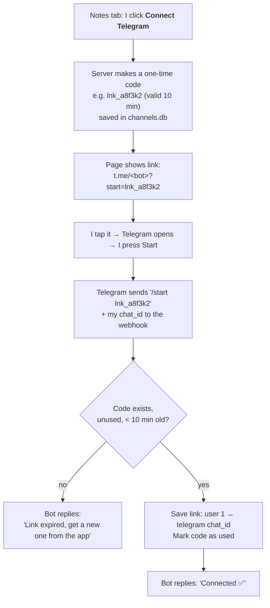
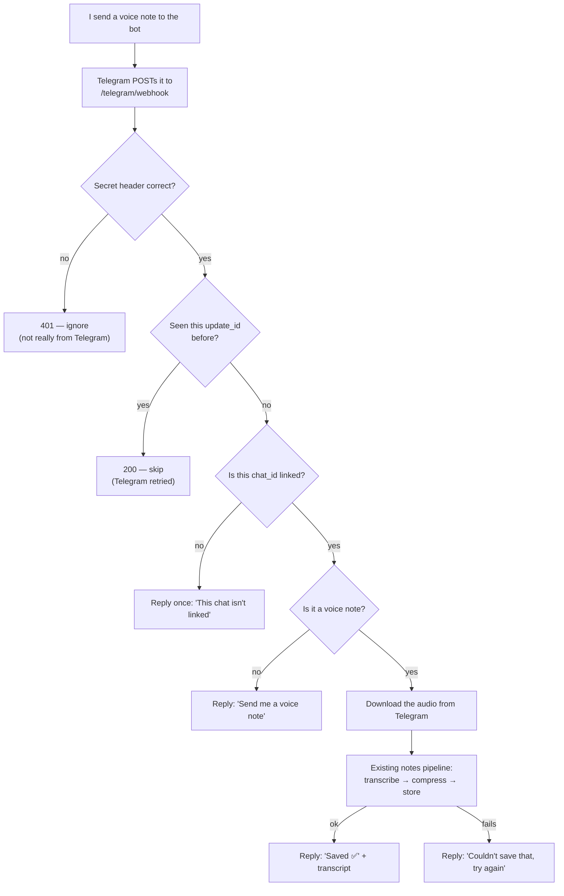
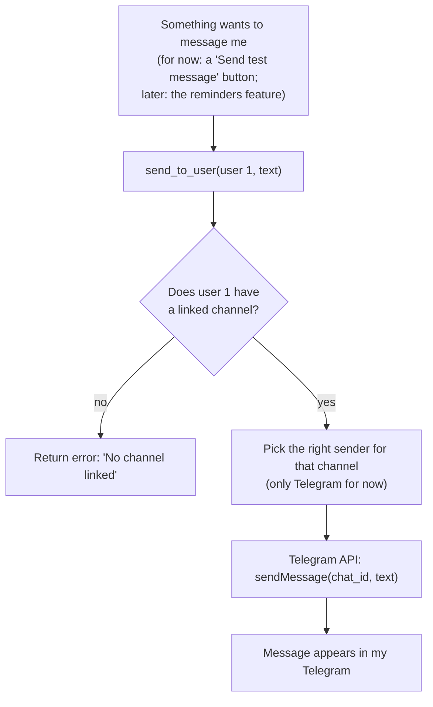
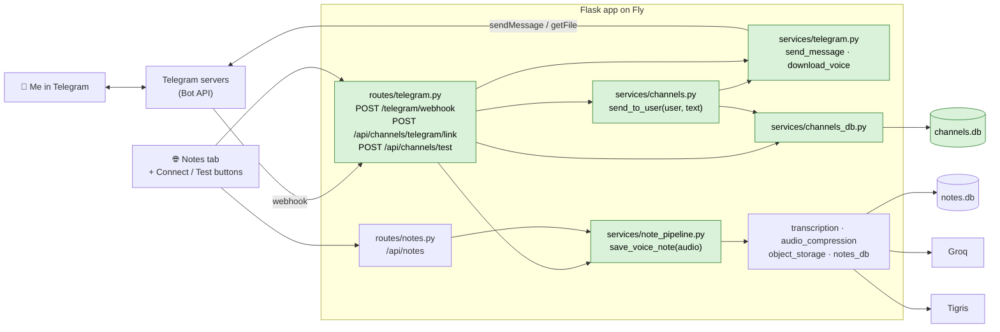

# Messaging channel (Telegram)

**Status:** 🔒 Locked  <!-- 1. Think → 2. Draw → 🔒 Locked → 3. Build → ✅ Shipped -->

---

## 1. Think

**Problem:** Voice notes can only be recorded in the web app, and the
server has no way to message me later (e.g. a reminder on Thursday for
something I said on Monday).

**Building:**
- Send a voice note in Telegram → it goes through the existing notes
  pipeline (transcribe → compress → store).
- The server can send me a message any time.
- Connect my Telegram once, by tapping a link. Never again.
- Keep Telegram-specific code in one place, so WhatsApp could be
  added later without touching the rest.

**Not building:**
- WhatsApp (maybe later).
- *When* reminders fire — that's the reminders feature
  (`docs/plans/PLAN_LLM_REMINDERS.md`). Here I just prove the pipe with a test message.
- User accounts — that's the multi-user feature, which comes last.

**Options I looked at:**
| Option | Good | Bad |
|--------|------|-----|
| **Telegram** | Free. One bot serves everyone. Can message any time. Voice notes built in. | Fewer people use it than WhatsApp. |
| **WhatsApp** | Everyone has it. | Can only message freely within 24h of the user writing to you; after that, pre-approved templates only, paid per message. Needs Meta business verification and a separate phone number. |

**Open questions:** *(all answered 2026-09-19)*
- [x] Linking needs a "user", but the app has no accounts yet.
      → **Strictly just me for this prototype.** We are explicitly keeping this bot private to the owner. Every link belongs to `user_id = 1`, and we will not build multi-user routing for this bot right now.
- [x] TypeScript or Python?
      → **Python, inside the Flask app.** One deploy, and it reuses the
      existing voice-notes code directly.
- [x] Where do linked chats get stored?
      → **New `channels.db`**, same pattern as `tasks.db` / `canvas.db` / `notes.db`.
- [x] What if someone who isn't linked messages the bot?
      → **Reply once with a short "this chat isn't linked"** and do nothing else.

---

## 2. Draw

There are three flows: **connect once**, **voice note in**, **message out**.

### Flowchart 1 — Connect Telegram (done once)

### Flowchart 2 — Voice note in

The note then shows up in the Notes tab like any other.

### Flowchart 3 — Message out

### Architecture — the parts and who talks to whom

🟩 green = new · ⬜ plain = already exists

**How the "channel abstraction" works, in plain words:**
- **In:** each channel has its own route that turns *its* message
  format into "audio bytes from user 1", then calls the same
  `save_voice_note()`. The web app does the same thing today.
- **Out:** everything else calls `send_to_user(user, text)`. Only
  `services/channels.py` knows Telegram exists. Adding WhatsApp later =
  one new sender + one new route. Nothing else changes.

### Data — `channels.db`

| Table | Columns | What it's for |
|-------|---------|---------------|
| `links` | `user_id`, `channel` (`'telegram'`), `channel_user_id` (the chat_id), `linked_at` | Who is connected where. One link per user per channel — linking again replaces the old one. |
| `link_codes` | `code`, `user_id`, `created_at`, `used_at` | The one-time codes. Valid 10 minutes, usable once. |
| `seen_updates` | `update_id`, `seen_at` | So a message Telegram sends twice isn't saved twice. |

### Routes

| Route | Protected by | Does |
|-------|--------------|------|
| `POST /telegram/webhook` | Telegram's secret header | Receives every message sent to the bot |
| `POST /api/channels/telegram/link` | API key (like other routes) | Makes a code, returns the `t.me` link |
| `POST /api/channels/test` | API key | Sends "Test ✅" via `send_to_user` |

### Secrets (set with `fly secrets set`)
`TELEGRAM_BOT_TOKEN` (from BotFather), `TELEGRAM_BOT_USERNAME`,
`TELEGRAM_WEBHOOK_SECRET` (any random string; also given to Telegram
once when registering the webhook).

### What could go wrong

| Problem | What happens |
|---------|--------------|
| Someone fakes a request to the webhook | Wrong/missing secret header → 401, ignored |
| Telegram sends the same message twice | `update_id` already in `seen_updates` → skipped |
| Groq / Tigris is down | Bot replies "couldn't save, try again"; nothing half-saved (same order as today's notes route) |
| Link code expired or already used | Bot replies "get a new link from the app" |
| Stranger finds the bot | One "not linked" reply, nothing else |
| Bot token leaks | Revoke it in BotFather, set the new one as a Fly secret |

### Decisions
- **Telegram first, WhatsApp maybe later.** The whole point is sending
  reminders later, and WhatsApp makes that hard and paid. Revisit if
  real users ask for WhatsApp. *(2026-09-19)*
- **Strictly single-user prototype** (`user_id = 1`) — we are explicitly keeping this bot private to you for now. The multi-user model is out of scope for this prototype. *(Updated 2026-09-24)*
- **Python in the Flask app** — one deploy, reuses the notes code. *(2026-09-19)*
- **`channels.db`** — matches how every other feature stores data. *(2026-09-19)*
- **Unlinked chats get one short reply** — so I can tell the bot is
  alive when testing from a new device. *(2026-09-19)*
- **Move the notes pipeline into `services/note_pipeline.py`** so the web
  app and Telegram share one `save_voice_note()` instead of copying the
  code. *(2026-09-19)*
- **Webhook, not polling** — the Fly machine is always on
  (`auto_stop_machines = false`), so Telegram can always reach it. *(2026-09-19)*
- **Simple abstraction: two plain functions** (`save_voice_note` in,
  `send_to_user` out), not classes/interfaces — enough for one channel,
  easy to grow. *(2026-09-19)*

---

## 3. Build

Draft task list — each step works on its own:
- [x] Move notes pipeline into `services/note_pipeline.py`; web notes still work
- [x] Create bot in BotFather; set the 3 Fly secrets
- [x] `channels_db.py` + `channels.db` tables
- [x] `services/telegram.py` (send_message, download_voice)
- [x] Webhook route + register it with Telegram (`setWebhook`)
- [x] Link flow + "Connect Telegram" button in Notes tab
- [x] Voice note in → saved → "Saved ✅" reply
- [x] `send_to_user` + "Send test message" button
- [x] Update `PROJECT_STRUCTURE.md` and `ARCHITECTURE.md`

**What actually got built / what I learned:**
