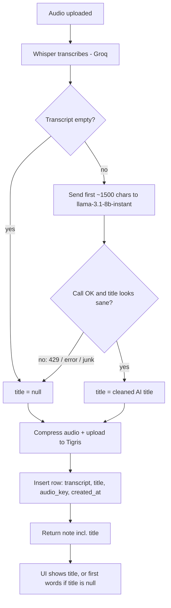
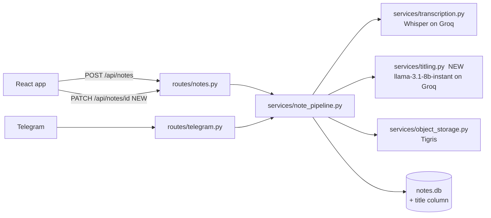

# Notes first + AI titles

**Status:** 🔒 Locked  <!-- 1. Think → 2. Draw → 🔒 Locked → 3. Build → ✅ Shipped -->

Branch: `feature/notes-first-ai-titles`

---

## 1. Think

**Problem:**
1. A voice note is just a wall of transcript. In the list, the "title" is
   only the first line of what I said (`getNoteTitle()` in
   `frontend/src/features/notes/noteText.ts`), so I can't tell at a glance
   what a note is about.
2. The app's real everyday use is now **recording notes**, but Home is
   built around tasks (running timer, today's task stats). Notes are one
   tab away instead of front and centre.

**Building:**
- Every new note gets a short AI title (3–7 words), saved with the note.
- The title can be edited by hand.
- Old notes (recorded before this) get titles too, once.
- Telegram's "Saved ✅" reply shows the title.
- Home becomes notes-first: a big Record button, then recent notes
  grouped by day (Today / Yesterday / Earlier), each showing its title.
- Tasks stay, but as a secondary thing: a small "running task" strip on
  Home (only when a task is running), and the Tasks tab.
- Search covers titles as well as transcripts.

**Not building:**
- Folders, tags or AI categories for notes (maybe later - "arranging").
- AI summaries of notes (title only).
- A background job queue. The title call is fast enough to do inline.
- Any change to how transcription works.

**Options I looked at - which model writes the title:**
| Option | Good | Bad |
|--------|------|-----|
| **Groq `llama-3.1-8b-instant`** | Same Groq key + SDK I already use for Whisper. Free tier (≈30 req/min, 14,400/day). Very fast. Small model is plenty for a 3–7 word title. | Rate limits are per Groq account, shared with Whisper. 8B can occasionally ramble - handled by a strict prompt + cleanup. |
| Groq `llama-3.3-70b-versatile` | A bit more accurate. | Lower free-tier limits, slower. Overkill for a title. |
| OpenAI GPT-5 nano / Gemini Flash-Lite | Very cheap. | New account, new key, new SDK, costs money. No real gain. |
| No LLM - first words of the transcript | Free, no failure mode. | That's what we have today, and it's the problem. |

→ Use `llama-3.1-8b-instant`; the first-words title stays as the fallback.

**Options I looked at - Home layout:**
| Option | Good | Bad |
|--------|------|-----|
| **A. Rework Home into a notes-first page** (Record + recent notes by day + small task strip). Keep `/notes` as the full list with search. | Home answers "record / what did I say recently" instantly; full list still has room for search. Small change to routing. | Two places show notes (Home = recent, Notes = all). |
| B. Make `/` *be* the Notes page and drop the separate Home | One place for notes. | Lose the "running task" glance entirely, or cram it into the notes page. Bigger nav/route change. |

**Open questions:** *(all answered 2026-10-03)*
- [x] Home layout: A or B?
      → **A. Rework Home** into Record + recent notes by day + a small running-task strip. `/notes` stays as the full searchable list.
- [x] Old notes: script or per-note button?
      → **One-time script** (`scripts/backfill_note_titles.py`), run once on Fly with `fly ssh console`. Only touches notes whose title is empty, so re-running it is safe.
- [x] Phone's centre ➕ button?
      → **Keep the Capture sheet** (note *or* task) as it is today.
- [x] Bottom nav order on phones?
      → **`Home · Notes · ➕ · Tasks · More`** - Notes moves next to Home, Tasks moves right.

---

## 2. Draw

### Flowchart - saving a note (web or Telegram)

### Architecture - the parts and who talks to whom

### Decisions
- **Title model = Groq `llama-3.1-8b-instant`.** Free, already-wired provider; one place to change it (`MODEL` constant in `services/titling.py`).
- **The title must never block saving a note.** `generate_title()` never raises - on any failure it returns `None` and the note saves with no title. The UI falls back to the first words.
- **Inline, not background.** The 8B call is a fraction of a second next to Whisper + ffmpeg, so no job queue. Keeps it simple.
- **Cheap + accurate prompt:** system prompt "Return only a title of 3–7 words for this voice note. Same language as the note. No quotes, no ending punctuation."; `temperature=0`; `max_tokens=20`; send only the first 1500 characters.
- **Cleanup after the model (`clean_title`, a pure function, unit-tested):** strip quotes/"Title:" prefixes/trailing dots, collapse whitespace, cap at 60 chars; empty → `None`.
- **DB: `title TEXT NULL` column on `notes`.** Added by `ensure_notes_db()` with a `PRAGMA table_info` check + `ALTER TABLE ADD COLUMN`, so the existing notes.db on the Fly volume upgrades itself on the next request - no manual migration.
- **API:** `title` added to every note in responses (nullable). New `PATCH /api/notes/<id>` with `{"title": "..."}` for manual edits. `static/openapi.yaml` updated.
- **Frontend:** `Note.title: string | null`; `getNoteTitle(note)` = `title ?? first words`. List shows title (bold) + one-line preview. Note detail has an editable title. Search matches title + transcript. New pure helper `groupNotesByDay()` for Today / Yesterday / Earlier (unit-tested).
- **Home:** Record card on top → recent notes grouped by day → "See all notes" link. Running-task strip shown only while a task runs. Today's task stats move off Home (still on Tasks / Time Log).
- **Sidebar order:** Home, Notes, Tasks, Time Log, Canvas. **Phone bottom nav:** Home · Notes · ➕ (Capture sheet, unchanged) · Tasks · More.
- **Backfill = one-time script**, not a UI button: old notes are a fixed, small set, so a button would be UI that's useless after one use. The script sleeps ~2s between calls to stay under the Groq free-tier limit of 30 requests/min.

---

## 3. Build

**Backend**
- [ ] `services/titling.py` - `clean_title()` + `generate_title()` (never raises)
- [ ] `services/notes_db.py` - `title` column migration, `insert_note(..., title)`, `update_note_title()`
- [ ] `services/note_pipeline.py` - call `generate_title()` after transcription
- [ ] `routes/notes.py` - include `title`; add `PATCH /api/notes/<id>`
- [ ] `routes/telegram.py` - reply with title
- [ ] `scripts/backfill_note_titles.py` - title every note whose title is NULL (safe to re-run)
- [ ] Tests: `clean_title`, pipeline saves when titling fails, DB migration on an old-shape table, PATCH route
- [ ] `static/openapi.yaml`

**Frontend**
- [ ] `types/note.ts` - `title`
- [ ] `noteText.ts` - `getNoteTitle(note)`, search on title, `groupNotesByDay()` + tests
- [ ] `NoteList` / `NoteDetail` - show title, edit title (`useUpdateNoteTitle` mutation)
- [ ] `HomePage` - notes-first layout + small running-task strip
- [ ] Nav: sidebar order + bottom nav `Home · Notes · ➕ · Tasks · More`

**Wrap-up**
- [ ] `PROJECT_STRUCTURE.md` (new service, new script, new endpoint, new column)
- [ ] Run pytest + vitest + `npm run build`; check Home on phone width
- [ ] Deploy to Fly, record a note, confirm the title appears

**What actually got built / what I learned:**
